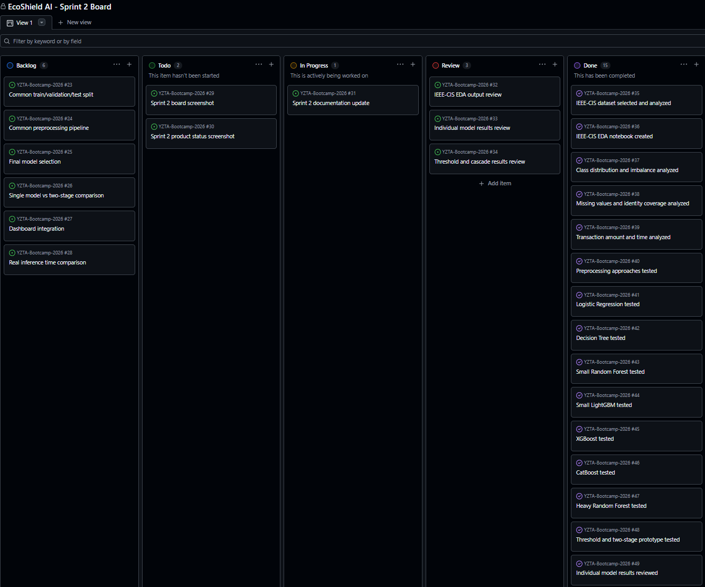
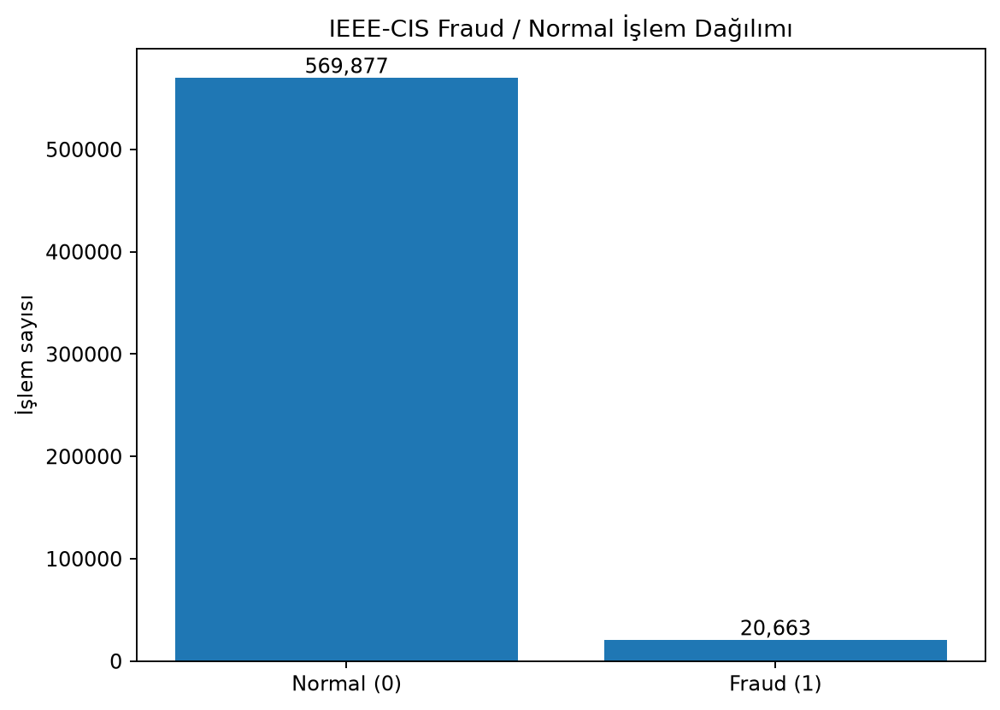
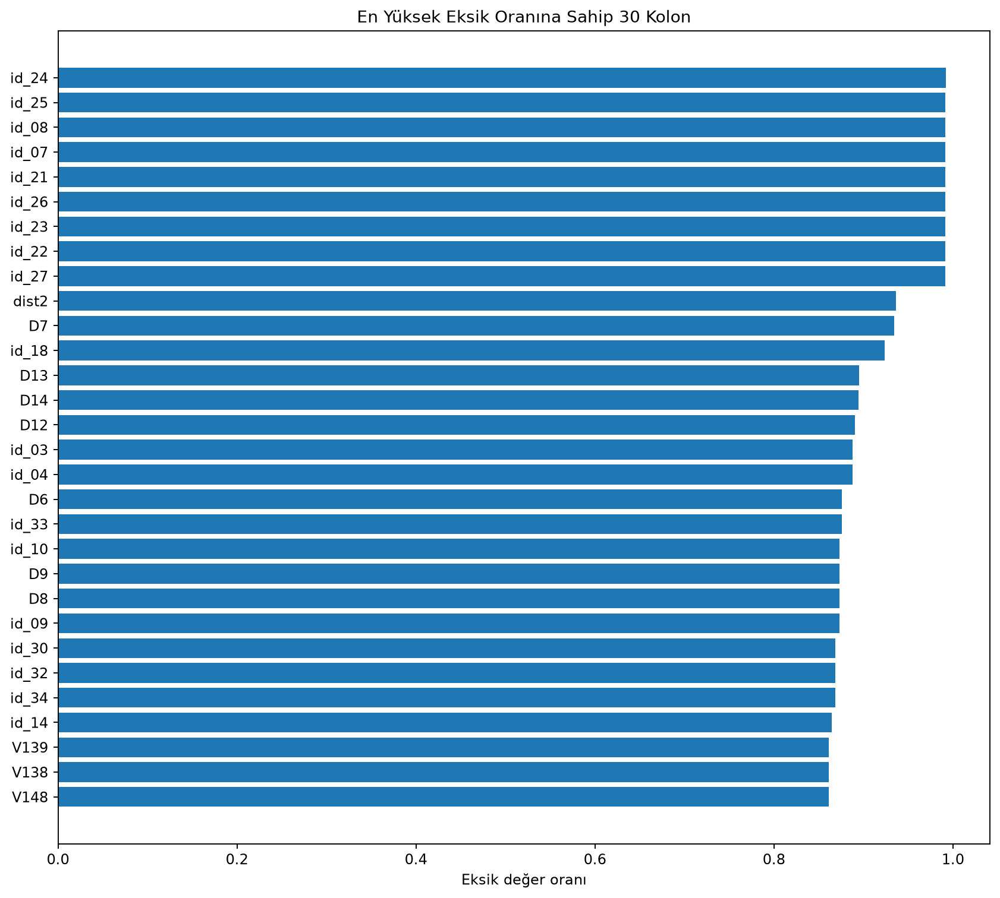
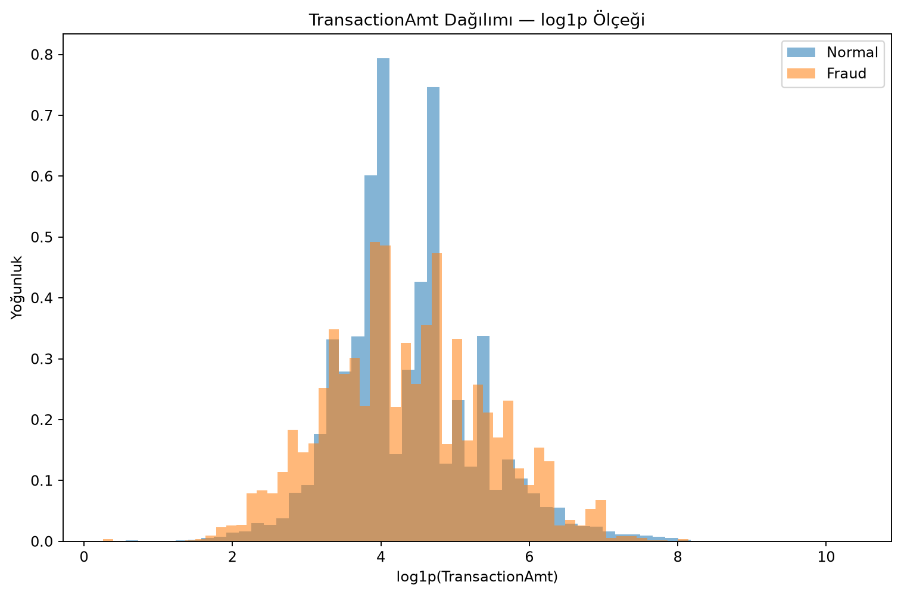
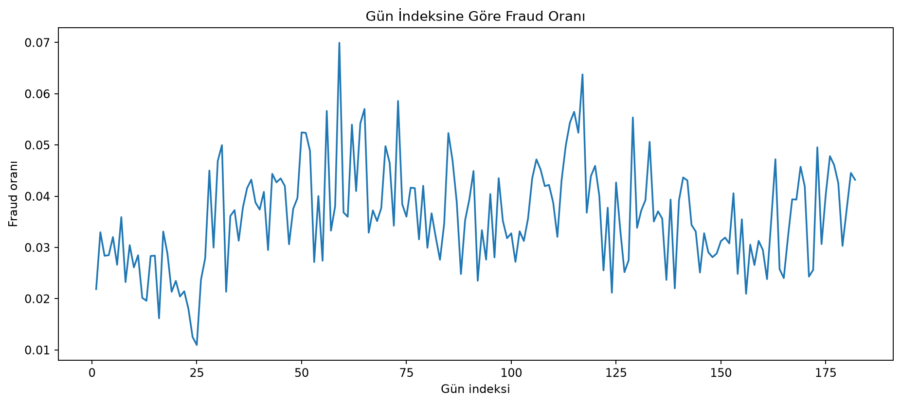
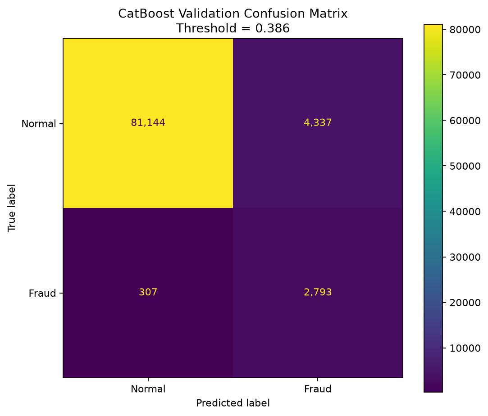
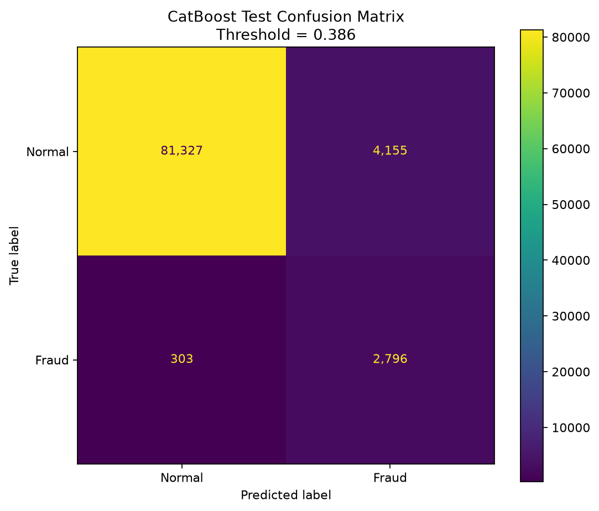
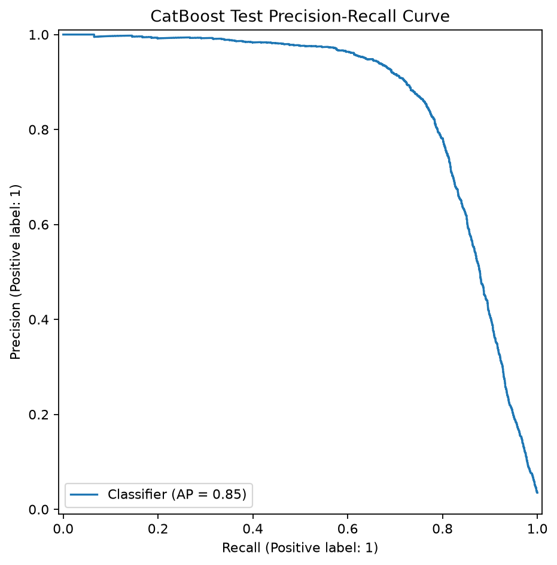
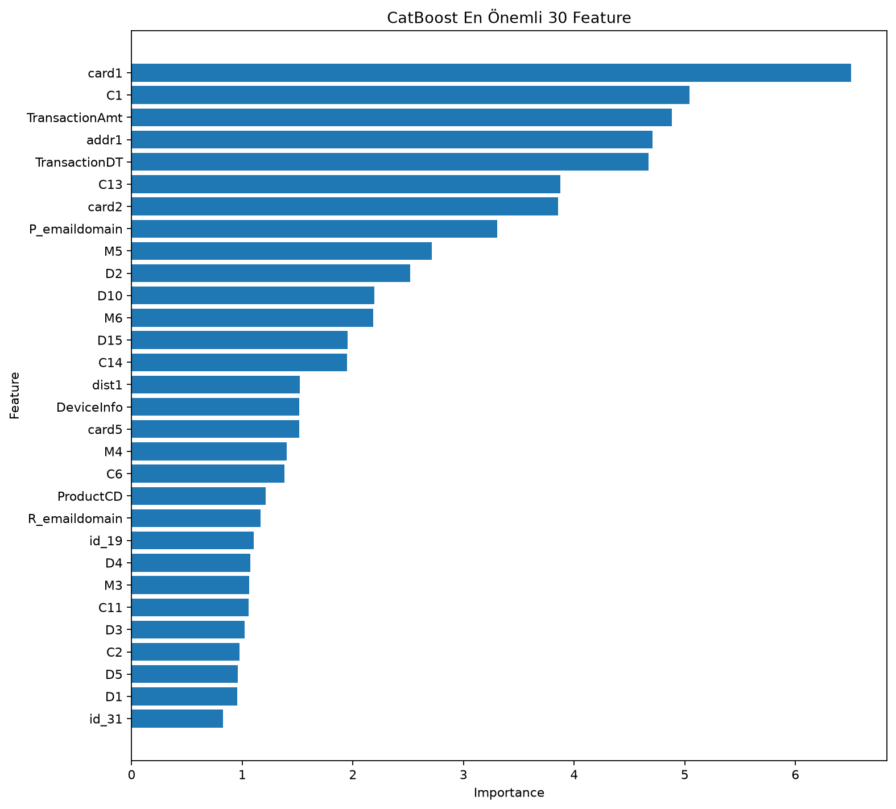

# EcoShield AI

EcoShield AI, finansal işlemlerde dolandırıcılık tespitini daha verimli hale getirmek için geliştirilmiş yapay zeka destekli bir fraud detection platformudur.

Proje, klasik tek aşamalı fraud detection yaklaşımı yerine iki aşamalı bir model mimarisi kullanmayı hedefler. İlk aşamada hafif bir model tüm işlemleri hızlıca tarar. İkinci aşamada ise yalnızca riskli görülen işlemler daha güçlü bir modele gönderilir. Bu yaklaşım ile hem fraud tespit performansının artırılması hem de gereksiz model çalıştırma maliyetinin azaltılması amaçlanmaktadır.

## Hedefler

- Fraud detection için baseline model geliştirmek
- Class imbalance problemini analiz etmek
- Precision, recall, F1, ROC-AUC gibi metrikleri karşılaştırmak
- İki aşamalı hafif model + ağır model mimarisi kurmak
- Riskli işlemleri dashboard üzerinde göstermek
- Model çağrı sayısı üzerinden compute-saving metriği üretmek

## Ürün Özellikleri

- Finansal işlem verileri üzerinde fraud / normal işlem analizi
- Class imbalance probleminin incelenmesi
- Precision, recall, F1-score, ROC-AUC ve PR-AUC gibi metriklerle model değerlendirme
- SMOTE, class weight ve threshold tuning gibi yöntemlerin karşılaştırılması
- Hafif model + ağır model şeklinde iki aşamalı fraud detection mimarisi
- Riskli işlemleri dashboard üzerinde gösterme
- Model çağrı sayısı üzerinden compute-saving metriği üretme

---

# Problem Tanımı

Finansal dolandırıcılık tespiti, dijital ödeme sistemleri, fintech girişimleri, bankalar ve e-ticaret ödeme altyapıları için kritik bir problemdir.

Fraud detection problemlerinde veri genellikle ciddi şekilde dengesizdir. Normal işlemler çok fazla, fraud işlemleri ise çok az sayıdadır. Bu nedenle accuracy metriği tek başına yeterli değildir.

Bu projede fraud detection problemi şu açılardan ele alınacaktır:

- Class imbalance analizi
- Baseline model geliştirme
- Precision, recall, F1-score, ROC-AUC ve PR-AUC metrikleriyle değerlendirme
- SMOTE / class weight / threshold tuning gibi yöntemlerin karşılaştırılması
- Hafif model + ağır model şeklinde iki aşamalı model mimarisi
- Compute-saving / model çağrı azaltımı metriği

---

# Hedef Kitle

- Fintech girişimleri
- Dijital ödeme sistemleri
- Bankalar
- Risk ve fraud ekipleri
- Dijital cüzdan uygulamaları
- E-ticaret ödeme altyapıları

---

# Veri Seti

İlk aşamada **Credit Card Fraud Detection** veri seti kullanılmıştır.

Target değişkeni:

- `Class = 0` → Normal işlem
- `Class = 1` → Fraud işlem

Sprint 1 kapsamında bu veri seti üzerinde EDA, class imbalance analizi ve temel veri inceleme çalışmaları yapılmıştır.

---

# Product Backlog

| No | User Story | Öncelik | Durum |
|---|---|---:|---|
| PB-1 | Kullanıcı olarak işlem verilerini sisteme yükleyebilmek istiyorum. | Yüksek | Planlandı |
| PB-2 | Sistem olarak yüklenen veriyi temizleyip model eğitimine hazır hale getirmeliyim. | Yüksek | Devam ediyor |
| PB-3 | Kullanıcı olarak fraud ve normal işlem dağılımını görebilmek istiyorum. | Yüksek | Devam ediyor |
| PB-4 | Sistem olarak baseline fraud detection modeli eğitmeliyim. | Yüksek | Planlandı |
| PB-5 | Kullanıcı olarak modelin precision, recall, F1, ROC-AUC gibi metriklerini görebilmeliyim. | Yüksek | Planlandı |
| PB-6 | Sistem olarak class imbalance problemini SMOTE veya class weight ile ele almalıyım. | Yüksek | Planlandı |
| PB-7 | Sistem olarak threshold tuning yaparak fraud yakalama performansını iyileştirmeliyim. | Yüksek | Planlandı |
| PB-8 | Sistem olarak hafif model + ağır model şeklinde iki aşamalı mimari kurmalıyım. | Yüksek | Planlandı |
| PB-9 | Kullanıcı olarak riskli işlemleri dashboard üzerinde listeleyebilmeliyim. | Yüksek | Planlandı |
| PB-10 | Kullanıcı olarak bir işlemin neden riskli görüldüğünü açıklamalı şekilde görebilmeliyim. | Orta | Planlandı |
| PB-11 | Sistem olarak compute-saving / model çağrı azaltımı metriği göstermeliyim. | Orta | Planlandı |
| PB-12 | Kullanıcı olarak demo arayüzünden örnek işlem analizi yapabilmeliyim. | Orta | Planlandı |
| PB-13 | Kullanıcı olarak model performanslarını karşılaştırmalı şekilde görebilmeliyim. | Orta | Planlandı |
| PB-14 | Sistem olarak eğitim sonucunda model dosyalarını kaydetmeliyim. | Orta | Planlandı |
| PB-15 | Proje ekibi olarak tüm geliştirme sürecini GitHub üzerinde belgelemeliyiz. | Yüksek | Devam ediyor |

## Backlog Dağıtma Mantığı

Product backlog, ürünün veri hazırlama, modelleme, değerlendirme, iki aşamalı mimari ve dashboard geliştirme ihtiyaçlarına göre oluşturulmuştur.

İlk sprintte temel veri analizi ve proje yönünün netleştirilmesine öncelik verilmiştir. Sonraki sprintlerde class imbalance yöntemleri, iki aşamalı model mimarisi, dashboard ve compute-saving metriği geliştirilecektir.

## Önceliklendirme Kriterleri

Backlog maddeleri şu kriterlere göre önceliklendirilmiştir:

- MVP için zorunlu olması
- Modelleme sürecine temel oluşturması
- Demo sırasında gösterilebilir olması
- Yapay zeka katkısını güçlendirmesi
- Ürün bütünlüğüne katkı sağlaması

---

## Sprint Amacı

Bu sprintte EcoShield AI projesinin temel kapsamını belirlemek, veri setini seçmek, ilk veri analizlerini yapmak ve fraud detection problemi için sağlam bir başlangıç altyapısı oluşturmak hedeflenmiştir.

Sprint 1’in ana odağı:

- Proje fikrinin netleşmesi
- Veri setinin seçilmesi
- Repo ve dokümantasyon düzeninin oluşturulması
- EDA yapılması
- Fraud / normal işlem dağılımının analiz edilmesi
- Class imbalance probleminin tespit edilmesi
- Sprint board ve ürün durumu çıktılarının hazırlanması

Bu sprintte model eğitimi yapılmamıştır. Train/test split, baseline modelleme, model metrikleri ve iki aşamalı mimari Sprint 2 kapsamına bırakılmıştır.

---

## Sprint 1 Backlog

Bu sprintte Product Backlog içerisinden proje fikrinin netleştirilmesi, veri setinin seçilmesi, repo/dokümantasyon düzeninin kurulması ve ilk EDA çalışmalarının yapılması hedeflenmiştir.

| No | Sprint Task | Sorumlu | Durum |
|---|---|---|---|
| SB-1 | Proje fikrinin netleştirilmesi | Tüm ekip | Tamamlandı |
| SB-2 | Proje repo yapısının oluşturulması | Developer | Tamamlandı |
| SB-3 | `docs` klasörünün ve sprint dokümanlarının hazırlanması | Developer | Tamamlandı |
| SB-4 | Kullanılacak veri setlerinin araştırılması | Tüm ekip | Tamamlandı |
| SB-5 | Credit Card Fraud Detection veri setinin seçilmesi | Tüm ekip | Tamamlandı |
| SB-6 | Veri setinin `data/raw` klasörüne eklenmesi | Developer | Tamamlandı |
| SB-7 | EDA notebook dosyasının oluşturulması | Developer | Tamamlandı |
| SB-8 | Veri setinin satır/sütun yapısının incelenmesi | Developer | Tamamlandı |
| SB-9 | Fraud / normal işlem dağılımının analiz edilmesi | Developer | Tamamlandı |
| SB-10 | Eksik değer ve duplicate kontrolü yapılması | Developer | Tamamlandı |
| SB-11 | Class distribution grafiğinin oluşturulması | Developer | Tamamlandı |
| SB-12 | Amount ve Time değişkenlerinin temel dağılım analizinin yapılması | Developer | Tamamlandı |
| SB-13 | EDA çıktılarının `assets/sprint-1` klasörüne kaydedilmesi | Developer | Tamamlandı |
| SB-14 | Sprint board ekran görüntüsünün eklenmesi | Scrum Master | Planlandı |
| SB-15 | Ürün durumu ekran görüntülerinin eklenmesi | Tüm ekip | Planlandı |

---

## Story Seçimleri ve Backlog Dağılımı

Sprint 1’de ürünün temel teknik altyapısını oluşturacak görevler seçilmiştir.

Bu sprintte öncelik, final dashboard’u veya gelişmiş modeli tamamlamak değil; veri setini anlamak, fraud detection problemini doğru tanımlamak ve modelleme öncesi veri analizini tamamlamaktır.

Bu nedenle Sprint 1’de şu işlere öncelik verilmiştir:

- Veri setinin seçilmesi
- Repo ve klasör yapısının kurulması
- EDA notebook’unun hazırlanması
- Fraud / normal işlem dağılımının incelenmesi
- Class imbalance probleminin ortaya konması
- EDA çıktılarının görsel ve metinsel olarak kaydedilmesi

Bu seçimlerin nedeni, Sprint 1’de doğrudan model geliştirmeye geçmeden önce veri setinin yapısını anlamak ve fraud detection probleminin temel karakterini ortaya koymaktır. EDA sonucunda veri setindeki class imbalance problemi netleştirilecek, bu çıktı Sprint 2’de yapılacak train/test split, baseline modelleme, SMOTE / class weight ve threshold tuning çalışmaları için temel oluşturacaktır.

---

## Sprint Board

Sprint board için aşağıdaki kolonlar kullanılacaktır:

```text
Backlog
To Do
In Progress
Review
Done
```

Sprint board üzerinde görevler bu kolonlar arasında ilerletilecektir. Her görev başlangıçta Backlog veya To Do kolonunda yer alacak, geliştirme sürecine alındığında In Progress kolonuna taşınacak, kontrol bekleyen işler Review kolonunda tutulacak ve tamamlanan işler Done kolonuna aktarılacaktır.

Sprint board ekran görüntüsü aşağıdaki klasöre mevcuttur:

```text
assets/sprint-1/sprint_board.png
```


---

## Daily Scrum Notları

### Daily Scrum 1

**Tarih:** 23.06.2026

**Toplantı Özeti:**

İlk Scrum toplantısında ekip olarak farklı proje temaları üzerine araştırma yapılmasına karar verilmiştir. Proje fikrinin doğrudan seçilmesi yerine, önce farklı alanlardaki makaleler, veri setleri ve uygulanabilir proje örnekleri incelenerek daha sağlam bir karar verilmesi hedeflenmiştir.

Bu doğrultuda araştırma sürecinin 2-3 Temmuz tarihine kadar devam ettirilmesi önerilmiştir. Elde edilen makale, veri seti ve proje fikirleri üzerinden sıfırdan yeni bir proje oluşturulması veya birden fazla fikrin güçlü yönlerini birleştiren daha kapsamlı bir proje geliştirilmesi planlanmıştır.

**Alınan Kararlar:**

- Farklı temalar üzerinden makale ve proje araştırması yapılacak.
- Araştırma süreci 2-3 Temmuz tarihine kadar sürdürülecek.
- Bulunan kaynaklar üzerinden sıfırdan veya bileşik bir proje fikri çıkarılacak.
- Ekip için sabit bir haftalık toplantı günü belirlenecek.
- Toplantı günü ekip içinde oylama ile kararlaştırılacak.
- Gerektiği haftalarda toplantı sayısı haftada 2’ye çıkarılabilecek.

**Blocker / Risk:**

- Henüz net bir proje fikri seçilmediği için araştırma sürecinin fazla uzaması riski bulunmaktadır.
- Bu riski azaltmak için araştırma süresine tarih sınırı konulmuştur.

---

### Daily Scrum 2

**Tarih:** 01.07.2026

**Toplantı Özeti:**

İkinci Scrum toplantısında ekip genelinde ortaya konan proje fikirleri detaylı şekilde değerlendirilmiştir. Fikirlerin uygulanabilirliği, veri bulunabilirliği, yapay zeka kullanımı, ürünleşme potansiyeli ve bootcamp süresi içerisinde tamamlanabilirliği üzerine tartışılmıştır.

Mevcut fikirlerin doğrudan seçilmesi yerine, bu fikirlerden daha bütünsel ve geniş kapsamlı bir proje vizyonu çıkarılıp çıkarılamayacağı üzerine beyin fırtınası yapılmıştır. Projenin stratejik yönünü netleştirmek için elde edilen verilerin ve potansiyel veri setlerinin analiz sürecine başlanmasına karar verilmiştir.

**Alınan Kararlar:**

- Mevcut proje fikirleri uygulanabilirlik açısından karşılaştırılacak.
- Her fikir için veri seti bulunabilirliği kontrol edilecek.
- AI/modelleme tarafı güçlü olan fikirler önceliklendirilecek.
- Veri analizinden elde edilecek sonuçlar, projenin nihai yönünü belirleyecek.
- Seçilecek projenin hem teknik olarak uygulanabilir hem de ürünleşebilir olmasına dikkat edilecek.

**Blocker / Risk:**

- Bazı proje fikirleri özgün olsa da yeterli veri seti bulunamama riski taşımaktadır.
- Bu nedenle proje seçiminde veri bulunabilirliği temel kriterlerden biri olarak belirlenmiştir.

---

### Daily Scrum 3

**Tarih:** 03.07.2026

**Toplantı Özeti:**

Üçüncü Scrum toplantısında ekip olarak üzerinde durulan potansiyel projelerin veri setleri detaylı şekilde incelenmiştir. Yapılan değerlendirmelerde her proje fikri; veri bulunabilirliği, model eğitilebilirliği, metriklerin gösterilebilirliği, dashboard geliştirme potansiyeli ve bootcamp süresinde tamamlanabilirliği açısından karşılaştırılmıştır.

Bu incelemeler sonucunda ekip ortak kararıyla **EcoShield AI - Fraud Detection** projesi üzerinde çalışılmasına karar verilmiştir. Projenin finansal dolandırıcılık tespiti üzerine kurulması, veri setlerinin erişilebilir olması ve modelleme sürecinde ROC-AUC, PR-AUC, recall, precision, F1-score ve confusion matrix gibi metriklerin net şekilde gösterilebilmesi nedeniyle bu fikir ön plana çıkmıştır.

Bir sonraki toplantıda görev dağılımı yapılarak veri analizi, modelleme, dokümantasyon ve arayüz geliştirme süreçlerine başlanması kararlaştırılmıştır.

**Alınan Kararlar:**

- Proje fikri olarak **EcoShield AI - Fraud Detection** seçildi.
- İlk veri seti olarak Credit Card Fraud Detection veri setiyle başlanmasına karar verildi.
- Fraud detection probleminin class imbalance içerdiği ve bu nedenle özel metriklerle değerlendirilmesi gerektiği belirlendi.
- Sonraki toplantıda görev dağılımı yapılacak.
- İlk aşamada EDA ve proje dokümantasyonu hazırlanacak.

**Blocker / Risk:**

- Fraud detection veri setleri ciddi class imbalance içerdiği için accuracy metriği tek başına yeterli olmayacaktır.
- Projenin klasik fraud detection projesi gibi görünmemesi için iki aşamalı hafif model + ağır model mimarisi ve compute-saving yaklaşımı özellikle vurgulanacaktır.

---

## Ürün Durumu

Sprint 1 sonunda ürün henüz çalışan bir dashboard veya tamamlanmış modelleme sistemi değildir. Bu sprintte ürünün temel veri analizi ve proje planlama altyapısı oluşturulmuştur.

Bu sprint sonunda elde edilen durum:

- Proje fikri olarak EcoShield AI seçildi.
- Repo ve dokümantasyon yapısı oluşturuldu.
- Credit Card Fraud Detection veri seti seçildi.
- Veri seti projeye eklendi.
- EDA notebook oluşturuldu.
- Veri setinin satır/sütun yapısı incelendi.
- Fraud / normal işlem dağılımı analiz edildi.
- Eksik değer ve duplicate kontrolü yapıldı.
- Class imbalance problemi tespit edildi.
- Class distribution, Amount distribution ve Time distribution grafikleri oluşturuldu.
- EDA özeti `assets/sprint-1/eda_summary.txt` dosyasına kaydedildi.

Sprint 1 kapsamında oluşturulan teknik çıktılar:

```text
notebooks/01_eda.ipynb
assets/sprint-1/class_distribution.png
assets/sprint-1/amount_distribution.png
assets/sprint-1/time_distribution.png
assets/sprint-1/eda_summary.txt
```

Sprint 1 EDA çıktıları:


EDA sonucunda elde edilen temel bulgular:

| Metrik | Değer |
|---|---:|
| Veri seti boyutu | 284,807 satır / 31 sütun |
| Normal işlem sayısı | 284,315 |
| Fraud işlem sayısı | 492 |
| Fraud oranı | %0.1727 |
| Eksik değer bulunan sütun sayısı | 0 |
| Duplicate satır sayısı | 1,081 |
| Normal/Fraud oranı | 577.88 |

Bu sprintte model eğitimi yapılmamıştır. Baseline modelleme, train/test split ve performans metrikleri Sprint 2’ye bırakılmıştır.

---

## Sprint Review

Sprint 1 sonunda EcoShield AI projesinin temel kapsamı belirlenmiş ve finansal dolandırıcılık tespiti problemi üzerine çalışılmasına karar verilmiştir. Ekip, farklı proje fikirlerini veri bulunabilirliği, model eğitilebilirliği, ürünleşme potansiyeli ve bootcamp süresinde tamamlanabilirlik açısından değerlendirmiştir.

Yapılan değerlendirmeler sonucunda fraud detection probleminin hem veri açısından erişilebilir hem de modelleme açısından ölçülebilir olduğu görülmüştür. Bu nedenle ilk aşamada Credit Card Fraud Detection veri setiyle başlanmasına karar verilmiştir.

Tamamlanan işler:

- Proje fikri netleştirildi.
- Hedef problem alanı belirlendi.
- Product backlog oluşturuldu.
- Sprint 1 backlog hazırlandı.
- Repo klasör yapısı oluşturuldu.
- Dokümantasyon dosyaları hazırlandı.
- Credit Card Fraud Detection veri seti seçildi.
- EDA notebook oluşturuldu.
- Veri setinin temel yapısı incelendi.
- Fraud / normal işlem dağılımı analiz edildi.
- Eksik değer ve duplicate kontrolü yapıldı.
- Class imbalance problemi tespit edildi.
- EDA çıktıları görsel ve metinsel olarak kaydedildi.

Eksik kalan / sonraki sprinte aktarılan işler:

- Train/test split yapılması
- Logistic Regression baseline modelinin eğitilmesi
- Random Forest / LightGBM gibi ikinci model denemeleri
- Confusion matrix ve model metriklerinin çıkarılması
- SMOTE ve class weight karşılaştırmaları
- Threshold tuning
- İki aşamalı hafif model + ağır model mimarisi
- Dashboard’un çalışan hale getirilmesi
- Compute-saving metriğinin hesaplanması

---

## Sprint Retrospective

### İyi Gidenler

- Proje fikri seçilmeden önce farklı temalar ve veri setleri karşılaştırıldığı için daha bilinçli bir proje seçimi yapılabildi.
- Proje fikri erken aşamada netleştirildi.
- Veri bulunabilirliği açısından uygulanabilir bir proje seçildi.
- Fraud detection problemi teknik olarak uygulanabilir bulundu.
- Repo ve dokümantasyon yapısı oluşturuldu.
- Product backlog ve sprint backlog hazırlandı.
- EDA ile veri setinin temel yapısı anlaşılmaya başlandı.

### Zorlayan Noktalar

- Fraud detection probleminin ciddi class imbalance içerdiği görüldü.
- Accuracy metriğinin bu problem için tek başına yeterli olmayacağı anlaşıldı.
- Projenin klasik fraud detection gibi görünmemesi için iki aşamalı enerji-verimli mimarinin daha net vurgulanması gerektiği fark edildi.
- IEEE-CIS Fraud Detection veri setinin daha gerçekçi fakat daha karmaşık olduğu görüldü. Bu nedenle ilk sprintte daha hızlı analiz edilebilir Credit Card Fraud Detection veri setiyle başlanmasına karar verildi.

### Bir Sonraki Sprintte İyileştirilecekler

- EDA sonucunda tespit edilen class imbalance problemi modelleme sürecinde dikkate alınacak.
- Train/test split işlemi stratified şekilde yapılacak.
- İlk baseline model olarak Logistic Regression eğitilecek.
- Accuracy yerine recall, precision, F1-score, ROC-AUC ve PR-AUC metrikleri birlikte değerlendirilecek.
- Random Forest veya LightGBM ile ikinci bir model denemesi yapılacak.
- SMOTE, class weight ve threshold tuning yöntemleri Sprint 2 kapsamında test edilecek.
- Model çıktıları dashboard’da gösterilebilecek hale getirilecek.
- Sprint board ekran görüntüsü ve ürün durumu görselleri repo’ya eklenecek.

---

## Sprint 1 Teknik Minimum Hedefler

Sprint 1 sonunda teknik olarak şu çıktıların oluşturulması hedeflenmiştir:

1. Veri seti seçildi.
2. EDA notebook oluşturuldu.
3. Veri setinin satır/sütun yapısı incelendi.
4. Fraud / normal işlem dağılımı gösterildi.
5. Eksik değer kontrolü yapıldı.
6. Duplicate kontrolü yapıldı.
7. Class distribution grafiği oluşturuldu.
8. Amount distribution grafiği oluşturuldu.
9. Time distribution grafiği oluşturuldu.
10. EDA özeti oluşturuldu.

Modelleme, train/test split ve performans metrikleri Sprint 2 kapsamına aktarılmıştır.

---

## Sprint 1 Sonuç Özeti

Sprint 1 kapsamında EcoShield AI projesinin temel yönü belirlenmiş ve finansal dolandırıcılık tespiti problemi üzerine ilerlenmesine karar verilmiştir. Bu sprintte, fraud detection probleminin veri yapısını hızlıca anlamak ve class imbalance durumunu net şekilde gözlemlemek amacıyla Credit Card Fraud Detection veri seti üzerinden ilk EDA çalışması yapılmıştır.

Credit Card Fraud Detection veri seti Sprint 1’de problem doğrulama ve hızlı EDA için kullanılmıştır. Ancak projenin sonraki aşamalarında daha gerçekçi, daha kapsamlı ve daha fazla değişken içeren IEEE-CIS Fraud Detection veri seti de denenecektir. Sprint 2’de IEEE-CIS veri setinin `train_transaction` ve `train_identity` dosyaları incelenerek preprocessing, eksik değer yönetimi, kategorik değişken dönüşümü ve modelleme sürecine uygunluğu değerlendirilecektir.

Bu sprintte elde edilen çıktılar, Sprint 2’de geliştirilecek train/test split, baseline modelleme, class imbalance yöntemleri, threshold tuning ve iki aşamalı hafif model + ağır model mimarisi için temel oluşturacaktır.

---

# Sprint 2 — EcoShield AI

## Sprint Amacı

Sprint 2 kapsamında, Sprint 1’de belirlenen fraud detection problemine yönelik daha kapsamlı veri analizi ve modelleme çalışmaları yürütülmüştür.

Bu sprintin ana hedefleri şunlardır:

- IEEE-CIS Fraud Detection veri setinin yapısını incelemek
- Veri setinin preprocessing ve modellemeye uygunluğunu değerlendirmek
- Farklı model ailelerini bireysel çalışmalarla denemek
- Hafif ve ağır model yaklaşımını deneysel bir seçenek olarak incelemek
- Threshold değerlerinin model performansı üzerindeki etkisini gözlemlemek
- Accuracy dışındaki fraud odaklı metrikleri değerlendirmek
- Ekip üyelerinin farklı yaklaşımlarını karşılaştırarak teknik revize alanlarını belirlemek

Bu sprintte kesin bir final model veya final mimari seçilmemiştir. Yapılan çalışmalar, sonraki sprintte uygulanacak ortak ve karşılaştırılabilir modelleme sürecine temel oluşturmuştur.

---

## Sprint 2 Backlog

| No | Sprint Task | Durum |
|---|---|---|
| SB2-1 | IEEE-CIS Fraud Detection veri setinin proje kapsamına alınması | Tamamlandı |
| SB2-2 | `train_transaction` ve `train_identity` tablolarının incelenmesi | Tamamlandı |
| SB2-3 | IEEE-CIS veri seti için ayrı EDA notebook’unun hazırlanması | Tamamlandı |
| SB2-4 | Fraud / normal işlem dağılımının analiz edilmesi | Tamamlandı |
| SB2-5 | Eksik değer, identity kapsama ve cardinality analizlerinin yapılması | Tamamlandı |
| SB2-6 | Transaction amount ve zaman değişkenlerinin incelenmesi | Tamamlandı |
| SB2-7 | EDA görselleri ve raporlarının kaydedilmesi | Tamamlandı |
| SB2-8 | Logistic Regression modelinin denenmesi | Tamamlandı |
| SB2-9 | Decision Tree modelinin denenmesi | Tamamlandı |
| SB2-10 | Küçük Random Forest modelinin denenmesi | Tamamlandı |
| SB2-11 | Küçük LightGBM modelinin denenmesi | Tamamlandı |
| SB2-12 | XGBoost modelinin denenmesi | Tamamlandı |
| SB2-13 | CatBoost modelinin denenmesi | Tamamlandı |
| SB2-14 | Ağır Random Forest modelinin denenmesi | Tamamlandı |
| SB2-15 | Hafif ve ağır model yaklaşımının deneysel olarak kurulması | Tamamlandı |
| SB2-16 | Hafif model threshold değerlerinin karşılaştırılması | Tamamlandı |
| SB2-17 | Compute-saving proxy hesabının denenmesi | Tamamlandı |
| SB2-18 | Ekip üyelerinin bireysel modelleme çalışmalarının karşılaştırılması | Tamamlandı |
| SB2-19 | Ortak split ve preprocessing standardının belirlenmesi | Sonraki sprinte aktarıldı |
| SB2-20 | Nihai model ve mimari seçiminin yapılması | Sonraki sprinte aktarıldı |
| SB2-21 | Seçilen modellerin ortak pipeline içerisinde birleştirilmesi | Sonraki sprinte aktarıldı |
| SB2-22 | Dashboard ve ürün entegrasyonu | Sonraki sprinte aktarıldı |

---

## Backlog Düzeni ve Story Seçimleri

Sprint 2’de doğrudan final ürün geliştirmeye geçmek yerine, modelleme tarafındaki alternatiflerin geniş biçimde denenmesine öncelik verilmiştir.

Bu doğrultuda:

- Sprint 1’de kullanılan Credit Card Fraud Detection veri setine ek olarak IEEE-CIS Fraud Detection veri seti incelenmiştir.
- Ekip üyeleri EDA, preprocessing ve model eğitim süreçlerini bireysel olarak yürütmüştür.
- Farklı model aileleri ve model parametreleri denenmiştir.
- Hafif ve ağır model yaklaşımı kesin mimari olarak değil, performansı ölçülecek deneysel bir seçenek olarak ele alınmıştır.
- Threshold değerlerinin fraud yakalama oranı ve ağır modele yönlendirilen işlem oranı üzerindeki etkisi incelenmiştir.

Bireysel çalışmalar aynı veri seti üzerinde yürütülmüş olsa da kullanılan train/validation/test oranları, preprocessing adımları ve model parametreleri farklılık göstermiştir. Bu nedenle elde edilen skorların doğrudan nihai model karşılaştırması olarak kullanılmamasına; sonraki aşamada ortak deney protokolü oluşturulmasına ihtiyaç olduğu değerlendirilmiştir.

---

## Daily Scrum Notları

### Daily Scrum 1

**Tarih:** 11.07.2026

**Toplantı Özeti:**

Sprint 2 kapsamında modelleme tarafında izlenebilecek yöntemler değerlendirilmiştir. Bu toplantıda kesin bir model seçimi yapılmamış; farklı model alternatiflerinin denenmesi ve sonuçlara göre değerlendirme yapılması planlanmıştır.

Projenin ayırt edici yönlerinden biri olabilecek hafif-ağır model mimarisi deneysel bir seçenek olarak ele alınmıştır. Bu yaklaşıma göre hafif modelin tüm işlemleri hızlı biçimde taraması, riskli gördüğü işlemleri ağır modele yönlendirmesi ve ağır modelin yalnızca yönlendirilen işlemler üzerinde final fraud probability / risk skoru üretmesi planlanmıştır.

Hafif model tarafında Logistic Regression, Decision Tree, küçük Random Forest ve küçük LightGBM; ağır model tarafında ise LightGBM, XGBoost, CatBoost ve Random Forest gibi modellerin denenmesi değerlendirilmiştir.

Model sonuçlarının yalnızca accuracy üzerinden yorumlanmaması; recall, precision, F1-score, ROC-AUC ve PR-AUC metriklerinin birlikte incelenmesi gerektiği vurgulanmıştır.

Ayrıca IEEE-CIS Fraud Detection veri setinin incelenmesi, preprocessing ve modelleme açısından uygunluğunun test edilmesi planlanmıştır. İki aşamalı yapının compute-saving sağlayıp sağlamadığı ve fraud detection performansını koruyup korumadığı deney sonuçları üzerinden değerlendirilecektir.

**Alınan kararlar ve planlanan çalışmalar:**

- Kesin model seçimi yapılmadan farklı model aileleri denenecek.
- IEEE-CIS veri seti için ayrı veri analizi yürütülecek.
- Hafif ve ağır model adayları ayrı ayrı değerlendirilecek.
- İki aşamalı model yapısı deneysel olarak kurulacak.
- Threshold değerlerinin recall ve yönlendirme oranı üzerindeki etkisi incelenecek.
- Accuracy yerine fraud odaklı metrikler birlikte raporlanacak.
- Nihai mimari kararı sonuçlar karşılaştırıldıktan sonra verilecek.

**Riskler:**

- Hafif model threshold değerinin yüksek seçilmesi fraud işlemlerin ağır modele ulaşmadan elenmesine neden olabilir.
- Threshold değerinin çok düşük seçilmesi ağır modele gönderilen işlem sayısını artırarak beklenen compute-saving avantajını azaltabilir.
- IEEE-CIS veri setindeki eksik değerler, yüksek cardinality ve geniş feature yapısı preprocessing sürecini zorlaştırabilir.

---

### Daily Scrum 2

**Tarih:** 17.07.2026

**Toplantı Özeti:**

Toplantıda her ekip üyesinin verinin keşifsel analizinden model eğitimine kadar tamamen bireysel ve farklı yaklaşımlarla yürüttüğü çalışmalar sırayla incelenmiştir.

Ekip üyeleri aynı IEEE-CIS veri seti üzerinde XGBoost, CatBoost, küçük LightGBM, Logistic Regression, Decision Tree ve Random Forest modellerini farklı train/validation/test dağılımları, preprocessing yöntemleri ve model parametreleri kullanarak eğitmiştir.

Toplantı boyunca bireysel çalışmaların:

- Veri hazırlama adımları
- Eksik değer yönetimi
- Kategorik değişken işlemleri
- Train/validation/test ayrımları
- Class imbalance yöntemleri
- Model parametreleri
- Threshold yaklaşımları
- Model metrikleri
- Eğitim ve tahmin süreçleri

tek tek değerlendirilmiştir.

Farklı yöntemlerle elde edilen çıktıların doğrudan karşılaştırılmasının adil olmayabileceği görülmüştür. Çünkü model sonuçları yalnızca algoritmadan değil; veri bölme yöntemi, preprocessing akışı, kullanılan feature’lar, class imbalance yaklaşımı ve threshold değerlerinden de etkilenmektedir.

Bu nedenle modellerin genel performansını iyileştirmek ve sonuçları karşılaştırılabilir hale getirmek için çeşitli teknik revize önerileri oluşturulmuştur.

**Teknik değerlendirmeler:**

- Modellerin ortak bir train/validation/test ayrımı üzerinde yeniden denenmesi gerekmektedir.
- Preprocessing adımlarının mümkün olduğunca ortaklaştırılması gerekmektedir.
- Threshold seçiminin yalnızca validation verisi üzerinden yapılması gerekmektedir.
- Test verisinin model veya threshold seçimi için kullanılmaması gerekmektedir.
- Accuracy dışında precision, recall, F1-score, ROC-AUC ve özellikle PR-AUC metrikleri birlikte raporlanmalıdır.
- Hafif model tarafında inference süresi ve ağır modele yönlendirilen işlem oranı da ölçülmelidir.
- İki aşamalı sistem, tek ağır model yaklaşımıyla aynı test seti üzerinde karşılaştırılmalıdır.
- Compute-saving ifadesinin yalnızca yönlendirilmeyen işlem oranıyla değil, gerçek inference süresiyle de desteklenmesi gerekmektedir.

**Alınan kararlar ve sonraki adımlar:**

- Bireysel çalışmalar korunacak ve teknik deney kaydı olarak değerlendirilecek.
- Modeller için ortak değerlendirme protokolü hazırlanacak.
- Seçilen aday modeller aynı veri ayrımı üzerinde yeniden eğitilecek.
- Preprocessing yöntemleri gözden geçirilerek ortaklaştırılacak.
- Hafif-ağır model yaklaşımı ve tek model yaklaşımı karşılaştırılacak.
- Nihai model seçimi Sprint 2 çıktıları tek başına kullanılarak yapılmayacak.
- Teknik revizyonlar tamamlandıktan sonra model seçimi ve ürün entegrasyonuna geçilecek.

**Riskler:**

- Farklı split ve preprocessing yöntemleriyle üretilen metriklerin doğrudan karşılaştırılması yanıltıcı olabilir.
- Aynı isimdeki model, farklı parametrelerle tamamen farklı sonuçlar üretebilir.
- Class imbalance yöntemlerinin validation ve test verisine yanlış uygulanması veri sızıntısına yol açabilir.
- Aşırı düşük threshold yüksek recall sağlarken sistemi pratikte verimsiz hale getirebilir.

---

## Sprint Board Update

Sprint 2 board’unda görevler şu kolonlar üzerinden takip edilmiştir:

```text
Backlog
To Do
In Progress
Review
Done
```

Sprint 2 sonunda IEEE-CIS EDA, bireysel model eğitimleri, threshold analizi ve deneysel hafif-ağır model çalışmaları tamamlanan işler arasında yer almıştır.

Ortak split, ortak preprocessing, nihai model seçimi, final pipeline ve dashboard entegrasyonu sonraki sprint çalışmalarına aktarılmıştır.

Sprint 2 board ekran görüntüsü aşağıdaki konumda mevcuttur:

```text
assets/sprint-2/sprint_board.png
```



---

## Ürün Durumu

Sprint 2 sonunda ürün, Sprint 1’deki veri analizi seviyesinden model denemelerinin gerçekleştirildiği deneysel prototip aşamasına ilerlemiştir.

Bu sprintte:

- IEEE-CIS Fraud Detection veri seti için kapsamlı EDA hazırlanmıştır.
- Fraud / normal işlem dağılımı analiz edilmiştir.
- Eksik değerler, identity kapsamı, kategorik değişkenler ve cardinality yapısı incelenmiştir.
- Logistic Regression, Decision Tree, küçük Random Forest, küçük LightGBM, XGBoost, CatBoost ve Random Forest modelleri farklı yaklaşımlarla denenmiştir.
- Hafif ve ağır model mantığı deneysel olarak uygulanmıştır.
- Threshold değerlerinin yönlendirme ve recall üzerindeki etkileri incelenmiştir.
- Ağır modele gönderilmeyen işlem oranı üzerinden compute-saving proxy hesabı denenmiştir.
- Model karşılaştırmalarında ortak deney protokolü ihtiyacı tespit edilmiştir.

### IEEE-CIS Class Distribution



### IEEE-CIS Missing Value Analizi



### Transaction Amount Analizi



### Gün Bazlı Fraud Oranı



### CatBoost Validation Confusion Matrix



### CatBoost Test Confusion Matrix



### CatBoost Precision-Recall Curve



### CatBoost Feature Importance



---

## Teknik Çalışmalar

### IEEE-CIS EDA

IEEE-CIS eğitim verisinde toplam **590.540 işlem** bulunmaktadır.

Sınıf dağılımı:

| Sınıf | İşlem Sayısı |
|---|---:|
| Normal işlem | 569.877 |
| Fraud işlem | 20.663 |

Veri setinde ciddi class imbalance bulunduğu doğrulanmıştır. Bu nedenle accuracy metriğinin tek başına uygun olmadığı; recall, precision, F1-score, ROC-AUC ve PR-AUC metriklerinin birlikte değerlendirilmesi gerektiği görülmüştür.

EDA kapsamında ayrıca:

- Transaction ve identity tablolarının yapısı
- Identity bilgilerinin kapsama oranı
- Eksik değer oranları
- Yüksek cardinality içeren kolonlar
- Transaction amount dağılımı
- Transaction zaman yapısı
- Temel kategorik değişkenlere göre fraud oranları
- Sayısal değişkenlerin target ile ilişkileri

incelenmiştir.

### Hafif Model Denemeleri

Hafif model tarafında şu model aileleri değerlendirilmiştir:

- Logistic Regression
- Decision Tree
- Küçük Random Forest
- Küçük LightGBM

“Küçük model” ifadesi, model kapasitesinin ve hesaplama maliyetinin sınırlandırılmış olmasını ifade etmektedir. Örneğin küçük Random Forest’ta ağaç sayısı ve derinlik; küçük LightGBM’de boosting turu, derinlik ve yaprak sayısı düşük tutulmaktadır.

Hafif modelin amacı final tahmini tek başına üretmekten çok:

- Tüm işlemleri hızlı taramak
- Fraud işlemleri mümkün olduğunca kaçırmamak
- Riskli işlemleri ağır modele yönlendirmek
- Ağır model çağrı sayısını azaltmak

olarak değerlendirilmiştir.

### Ağır Model Denemeleri

Ağır model tarafında şu model aileleri denenmiştir:

- Random Forest
- LightGBM
- XGBoost
- CatBoost

Ağır modellerin daha yüksek kapasiteyle fraud ve normal işlemleri ayırması hedeflenmiştir. Ancak modeller farklı split, preprocessing ve parametrelerle eğitildiği için mevcut sonuçlar nihai model sıralaması olarak değerlendirilmemiştir.

### Threshold Analizi

Hafif modelin ürettiği fraud olasılığı için farklı threshold değerleri denenmiştir.

Threshold değeri düşürüldüğünde:

- Daha fazla işlem riskli kabul edilmiştir.
- Ağır modele yönlendirilen işlem oranı artmıştır.
- Hafif model recall değeri yükselmiştir.
- Compute-saving avantajı azalmıştır.

Threshold değeri yükseltildiğinde:

- Daha az işlem ağır modele yönlendirilmiştir.
- Compute-saving proxy artmıştır.
- Fraud işlemlerin hafif aşamada elenme riski yükselmiştir.

Bu nedenle threshold seçiminin yalnızca recall veya yalnızca yönlendirme oranına göre yapılmaması gerektiği görülmüştür.

### İki Aşamalı Model Denemesi

Deneysel iki aşamalı sistemde:

```text
İşlem
  ↓
Hafif model
  ↓
Düşük risk → Normal kabul edilir
Yüksek risk → Ağır modele yönlendirilir
  ↓
Ağır model
  ↓
Final fraud kararı
```

akışı uygulanmıştır.

İlk deneylerde ağır modele yönlendirilmeyen işlem oranı üzerinden compute-saving proxy hesaplanmıştır. Ancak gerçek compute-saving değerlendirmesi için sonraki aşamada:

- Tek ağır model inference süresi
- Cascade toplam inference süresi
- Hafif model inference süresi
- Ağır modele yönlendirilen işlem sayısı
- RAM ve işlemci kullanımı
- Final fraud metrikleri

birlikte ölçülmelidir.

---

## Sprint Review

Sprint 2 kapsamında IEEE-CIS Fraud Detection veri seti proje kapsamına alınmış ve veri seti üzerinde ayrı bir EDA çalışması gerçekleştirilmiştir.

Ekip üyeleri modelleme sürecini bireysel olarak yürütmüş; Logistic Regression, Decision Tree, küçük Random Forest, küçük LightGBM, Random Forest, XGBoost ve CatBoost modellerini farklı veri bölme, preprocessing ve parametre yaklaşımlarıyla denemiştir.

Hafif ve ağır model yaklaşımı deneysel olarak uygulanmış, threshold değerlerinin fraud recall ve ağır modele yönlendirme oranı üzerindeki etkileri incelenmiştir.

Sprint sonunda şu çıktılar elde edilmiştir:

- IEEE-CIS veri yapısı daha ayrıntılı biçimde anlaşılmıştır.
- Class imbalance problemi doğrulanmıştır.
- Farklı model aileleri için ilk deneyler tamamlanmıştır.
- Hafif-ağır model mimarisinin teknik olarak uygulanabilir olduğu görülmüştür.
- Threshold seçiminin sistem performansı için kritik olduğu anlaşılmıştır.
- Compute-saving hesabının yalnızca yönlendirme oranıyla sınırlandırılmaması gerektiği belirlenmiştir.
- Modellerin adil biçimde karşılaştırılması için ortak split ve preprocessing ihtiyacı tespit edilmiştir.

Sprint sonunda **nihai model veya nihai mimari seçilmemiştir**.

---

## Sprint Retrospective

### İyi Gidenler

- IEEE-CIS gibi daha kapsamlı bir fraud detection veri seti başarıyla analiz edilmiştir.
- Ekip üyeleri farklı model aileleri üzerinde uygulamalı deneyim kazanmıştır.
- EDA’dan model eğitimine kadar tüm süreçler bireysel olarak uygulanmıştır.
- Hafif ve ağır model mantığı teorik seviyeden deneysel prototip seviyesine taşınmıştır.
- Threshold ile recall ve yönlendirme oranı arasındaki ilişki gözlemlenmiştir.
- Model sonuçlarının accuracy dışındaki metriklerle değerlendirilmesi gerektiği ekip genelinde netleşmiştir.
- Farklı yaklaşımların güçlü ve zayıf yönleri ortak toplantıda değerlendirilmiştir.

### Zorlayan Noktalar

- IEEE-CIS veri setinin geniş ve eksik değer ağırlıklı yapısı preprocessing sürecini zorlaştırmıştır.
- Ekip üyelerinin farklı split ve preprocessing yöntemleri kullanması sonuçların doğrudan karşılaştırılmasını zorlaştırmıştır.
- Aynı model aileleri farklı parametreler nedeniyle farklı davranışlar göstermiştir.
- Hafif model threshold seçiminin recall ve compute-saving arasında ciddi bir trade-off oluşturduğu görülmüştür.
- Compute-saving hesabının gerçek işlem süresiyle desteklenmediği durumlarda yalnızca proxy olarak kalacağı anlaşılmıştır.
- Bazı model dosyalarının GitHub’ın normal dosya boyutu sınırını aşabileceği görülmüştür; bu dosyaların repository dışında tutulması gerekmiştir.

### Bir Sonraki Sprintte İyileştirilecekler

- Ortak train/validation/test indeksleri kullanılacak.
- Modeller aynı preprocessing protokolüyle yeniden karşılaştırılacak.
- Threshold yalnızca validation verisi üzerinden seçilecek.
- Test verisi final değerlendirme dışında kullanılmayacak.
- Ortak model karşılaştırma tablosu hazırlanacak.
- Hafif model için recall, routed rate ve inference süresi birlikte raporlanacak.
- Ağır model için precision, recall, F1, ROC-AUC ve PR-AUC birlikte değerlendirilecek.
- Tek ağır model ile iki aşamalı sistem aynı test seti üzerinde karşılaştırılacak.
- Compute-saving proxy gerçek inference süresiyle desteklenecek.
- Nihai model ve mimari seçildikten sonra dashboard entegrasyonuna geçilecek.

---

## Sprint 2 Sonuç Özeti

Sprint 2 kapsamında EcoShield AI projesi, temel veri analizinden çoklu model denemelerinin yapıldığı deneysel modelleme aşamasına ilerlemiştir.

IEEE-CIS Fraud Detection veri seti ayrıntılı olarak incelenmiş; veri setindeki class imbalance, eksik değer, identity kapsama, cardinality ve işlem dağılımı problemleri ortaya konmuştur.

Ekip üyeleri Logistic Regression, Decision Tree, küçük Random Forest, küçük LightGBM, Random Forest, XGBoost ve CatBoost modellerini farklı yaklaşımlarla eğitmiş ve sonuçlarını karşılaştırmıştır. Hafif-ağır model mimarisi deneysel bir seçenek olarak uygulanmış, threshold değerlerinin fraud yakalama performansı ve ağır modele yönlendirme oranı üzerindeki etkileri gözlemlenmiştir.

Ancak farklı split, preprocessing ve model parametreleri kullanıldığı için Sprint 2 sonuçları nihai model seçimi olarak değerlendirilmemiştir. Sprint sonunda ortak bir deney protokolüne ihtiyaç olduğu belirlenmiştir.

Sonraki sprintte modellerin aynı veri ayrımı ve ortak preprocessing adımlarıyla yeniden değerlendirilmesi, tek model ve iki aşamalı yaklaşımın adil biçimde karşılaştırılması, gerçek inference süresinin ölçülmesi ve sonuçlara göre nihai model mimarisinin seçilmesi hedeflenmektedir.

---

# Sprint 3 — EcoShield AI

## Sprint Amacı

Sprint 3 kapsamında, Sprint 2 sonunda belirlenen ortak deney protokolü ihtiyacının giderilmesi ve EcoShield AI projesinin çalışan bir ürün prototipi olarak tamamlanması hedeflenmiştir.

Bu sprintin ana hedefleri şunlardır:

- Tüm modeller için ortak train/validation/test ayrımı oluşturmak
- Preprocessing işlemlerini yalnızca train splitine fit etmek
- Hafif ve ağır modelleri aynı veri protokolü üzerinde karşılaştırmak
- Threshold seçimini yalnızca validation splitinde yapmak
- Cascade ve tekil ağır model yaklaşımlarını adil biçimde karşılaştırmak
- Final modeli test splitinde yalnızca bir kez değerlendirmek
- Seçilen modeli Streamlit arayüzüne entegre etmek
- Tek işlem, toplu CSV ve açıklanabilirlik özelliklerini tamamlamak
- Model tahmin katmanını FastAPI servisi olarak Streamlit arayüzünden ayırmak
- FastAPI ve Streamlit servislerini Docker Compose ile birlikte çalıştırmak
- Proje dokümantasyonunu ve final ürün demosunu hazırlamak

Sprint 2’de deneysel olarak ele alınan hafif model + ağır model cascade yaklaşımı bu sprintte ortak split üzerinde kurulmuş ve ölçülmüştür. Ancak cascade yaklaşımı, final test sonuçlarında tekil **CatBoost D8 Balanced** modelinin gerisinde kaldığı için final ürün mimarisi olarak seçilmemiştir.

Final ürün, tüm işlemleri doğrudan CatBoost D8 Balanced modeliyle değerlendiren tek aşamalı bir karar destek prototipi olarak tamamlanmıştır.

---

## Sprint İçinde Tamamlanması Tahmin Edilen Puan

**100 puan**

## Puan Tamamlama Mantığı

Sprint 3 iş yükü; ortak veri protokolü, model karşılaştırmaları, threshold tuning, cascade deneyi, tekil ağır model optimizasyonu, final test değerlendirmesi, Streamlit entegrasyonu ve final dokümantasyonu dikkate alınarak 100 puan üzerinden değerlendirilmiştir.

| Görev Grubu | Puan |
|---|---:|
| Ortak split ve preprocessing pipeline | 15 |
| Hafif model karşılaştırması | 10 |
| Ağır model karşılaştırması | 10 |
| Threshold tuning | 10 |
| Cascade pipeline ve trade-off analizi | 10 |
| Tekil ağır model optimizasyonu | 15 |
| Final test karşılaştırması | 10 |
| Streamlit prototipi ve açıklanabilirlik | 10 |
| FastAPI ve Docker Compose entegrasyonu | 5 |
| Sprint dokümantasyonu ve final video hazırlığı | 5 |
| **Toplam** | **100** |

---

## Sprint 3 Backlog

| No | Sprint Task | Durum |
|---|---|---|
| SB3-1 | Ortak train/validation/test indekslerinin oluşturulması | Tamamlandı |
| SB3-2 | Transaction ve identity tablolarının `TransactionID` üzerinden left join ile birleştirilmesi | Tamamlandı |
| SB3-3 | Preprocessing işlemlerinin yalnızca train splitine fit edilmesi | Tamamlandı |
| SB3-4 | Modele özel preprocessing cache yapısının hazırlanması | Tamamlandı |
| SB3-5 | Hafif modellerin ortak validation splitinde karşılaştırılması | Tamamlandı |
| SB3-6 | Ağır modellerin ortak validation splitinde karşılaştırılması | Tamamlandı |
| SB3-7 | Threshold tuning işlemlerinin yalnızca validation splitinde yapılması | Tamamlandı |
| SB3-8 | Cascade pipeline adaylarının kurulması ve yönlendirme oranlarının ölçülmesi | Tamamlandı |
| SB3-9 | Cascade yaklaşımının tekil modellerle validation üzerinde karşılaştırılması | Tamamlandı |
| SB3-10 | Ağır modellerin hafif model filtresi olmadan tüm train verisi üzerinde optimize edilmesi | Tamamlandı |
| SB3-11 | Final model adayı olarak CatBoost D8 Balanced modelinin seçilmesi | Tamamlandı |
| SB3-12 | Cascade ve tekil CatBoost modelinin kilitli test splitinde bir kez karşılaştırılması | Tamamlandı |
| SB3-13 | Final test metrikleri, confusion matrix ve PR/ROC eğrilerinin kaydedilmesi | Tamamlandı |
| SB3-14 | Streamlit karar destek prototipinin hazırlanması | Tamamlandı |
| SB3-15 | Tek işlem ve toplu CSV tahmin özelliklerinin eklenmesi | Tamamlandı |
| SB3-16 | CatBoost SHAP açıklanabilirlik ekranının eklenmesi | Tamamlandı |
| SB3-17 | Model performansı ve teknik mimari ekranlarının hazırlanması | Tamamlandı |
| SB3-18 | FastAPI model servisinin ve health, model-info, predict ve explain endpointlerinin hazırlanması | Tamamlandı |
| SB3-19 | Streamlit tahmin akışının FastAPI servisine bağlanması | Tamamlandı |
| SB3-20 | FastAPI ve Streamlit servislerinin Docker Compose ile container hâline getirilmesi | Tamamlandı |
| SB3-21 | Sprint 3 dokümantasyonunun hazırlanması | Tamamlandı |
| SB3-22 | Üç dakikayı geçmeyen final ürün demo videosunun hazırlanması | Video çekimi bekleniyor |
| SB3-23 | Videonun YouTube'a liste dışı yüklenmesi ve bağlantısının doğrulanması | Video çekimi bekleniyor |

---

## Backlog Düzeni ve Story Seçimleri

Sprint 3’te öncelik, Sprint 2’de birbirinden farklı split ve preprocessing yöntemleriyle yürütülen model denemelerini ortak bir değerlendirme protokolüne taşımaya verilmiştir.

Bu doğrultuda:

- Tüm model ailelerinde aynı train, validation ve test indeksleri kullanılmıştır.
- Preprocessing yalnızca train splitine fit edilmiştir.
- Resampling kullanılacaksa yalnızca train splitine uygulanması kuralı korunmuştur.
- Validation spliti model, parametre ve threshold seçimi için kullanılmıştır.
- Test spliti geliştirme sürecinden izole edilmiş ve yalnızca final karşılaştırmada açılmıştır.
- Accuracy ana seçim metriği olarak kullanılmamıştır.
- Precision, recall, F1, ROC-AUC, PR-AUC, false positive, false negative, eğitim süresi ve inference süresi birlikte değerlendirilmiştir.

Sprint 2’de projenin özgün mimari adayı olarak belirlenen cascade yaklaşımı korunmuş ve gerçek bir deney olarak uygulanmıştır. Bunun yanında, hafif model filtresi olmadan doğrudan tüm işlemleri değerlendiren tekil ağır modeller de optimize edilmiştir.

Bu seçim sayesinde cascade yaklaşımının yalnızca teorik avantajı değil, gerçek validation ve test performansı da tekil model yaklaşımıyla karşılaştırılmıştır.

---

## Daily Scrum Notları

### Daily Scrum 1

**Tarih:** 01.08.2026

**Toplantı Gündemi:**

Sprint 3 kapsamında tek bir Daily Scrum toplantısı yapılacaktır. Toplantıda EcoShield AI projesinin tamamlanmış hali ekip tarafından incelenecek, final Streamlit prototipinin çalışan akışları kontrol edilecek ve teslim için hazırlanacak üç dakikalık tanıtım videosunun içeriği planlanacaktır.

Toplantının ana gündem maddeleri:

- Streamlit uygulamasının tamamlanmış halinin incelenmesi
- Tek işlem tahmin akışının kontrol edilmesi
- Yüksek, düşük ve sınırda risk demo profillerinin test edilmesi
- Toplu CSV tahmin akışının kontrol edilmesi
- SHAP açıklanabilirlik ekranının incelenmesi
- Final model performansı ve teknik mimari ekranının kontrol edilmesi
- FastAPI health, model-info, predict ve explain endpointlerinin kontrol edilmesi
- Streamlit arayüzünün tahminleri FastAPI üzerinden aldığının doğrulanması
- Docker Compose ile API ve Streamlit containerlarının birlikte çalıştığının kontrol edilmesi
- Cascade yaklaşımından neden vazgeçildiğinin video anlatımında nasıl açıklanacağının belirlenmesi
- Video için konuşma ve ekran kaydı akışının oluşturulması
- Video anlatımının ekip üyeleri arasında paylaştırılması
- Video kaydının yatay formatta ve en fazla üç dakika olacak şekilde hazırlanması
- YouTube liste dışı yükleme ve teslim bağlantısının kontrol edilmesi

**Toplantıda Kontrol Edilecek Final Kararlar:**

- Final modelin CatBoost D8 Balanced olarak sunulması
- Validation’da seçilen `0.400815` threshold değerinin sabit tutulması
- Cascade mimarisinin tamamlanmış bir deney olarak anlatılması, ancak final ürün mimarisi olarak gösterilmemesi
- Final test sonucuna göre model veya threshold’un yeniden değiştirilmemesi
- Streamlit uygulamasının otomatik finansal karar sistemi değil, açıklanabilir bir karar destek prototipi olarak tanıtılması
- Projede kullanılan FastAPI ve Docker mimarisinin kısa ve anlaşılır biçimde gösterilmesi
- Projede kullanılmayan RAG, vektör veritabanı veya agent mimarilerinin kullanılmış gibi anlatılmaması

**Riskler:**

- Video süresinin üç dakikayı aşması
- Teknik ayrıntılara fazla zaman ayrılması ve ürün demosunun geri planda kalması
- Ekran kaydı sırasında model dosyası veya uygulama bağımlılıkları nedeniyle hata oluşması
- Video içerisinde cascade yaklaşımının yanlışlıkla final mimari gibi anlatılması
- YouTube bağlantısının erişime kapalı kalması

**Toplantı Sonrası Eklenecekler:**

- Uygulama incelemesinde tespit edilen son düzeltmeler
- Kesin video görev dağılımı
- Kayıt ve kurgu sorumluları
- Alınan nihai kararlar
- Video tamamlandığında YouTube liste dışı bağlantısı

---

## Sprint Board Update

Sprint 3 board’unda görevler aşağıdaki kolonlar üzerinden takip edilmiştir:

```text
Backlog
To Do
In Progress
Review
Done
```

Sprint 3 sonunda ortak split, preprocessing pipeline, hafif ve ağır model karşılaştırmaları, threshold tuning, cascade deneyi, tekil ağır model optimizasyonu, final test karşılaştırması, Streamlit ürün prototipi, FastAPI model servisi ve Docker Compose entegrasyonu tamamlanmıştır.

Final video çekimi ve YouTube bağlantısının eklenmesi teslim öncesinde tamamlanacak işler olarak bırakılmıştır.

Sprint board ekran görüntüsü aşağıdaki konumda mevcuttur:

```text
assets/sprint-3/sprint_board.png
```


---

## Ürün Durumu

Sprint 3 sonunda EcoShield AI, deneysel modelleme çalışmasından çalışan bir fraud risk karar destek prototipine dönüştürülmüştür.

Final ürün:

- IEEE-CIS verisi için hazırlanmış ortak feature şemasını kullanır.
- Final model olarak CatBoost D8 Balanced modelini kullanır.
- Validation splitinde seçilen sabit threshold ile karar üretir.
- Tek işlem için fraud olasılığı ve inceleme sinyali gösterir.
- Transaction ve identity CSV dosyalarını `TransactionID` üzerinden left join ile birleştirebilir.
- Büyük CSV dosyalarında toplu ve parçalı tahmin yapabilir.
- Uzun işlemlerde ilerleme, işlenen satır, geçen süre ve ETA bilgisi gösterir.
- CatBoost SHAP ile tek işlem tahminini açıklayabilir.
- Tahmin ve açıklama isteklerini FastAPI model servisi üzerinden gerçekleştirir.
- Streamlit ve FastAPI servislerini ayrı containerlar olarak çalıştırır.
- Docker Compose ile iki servisi tek komutla ayağa kaldırabilir.
- Final test metriklerini ve karşılaştırma grafiklerini gösterir.
- Tahmin sonuçlarını CSV olarak dışarı aktarabilir.

Ürün otomatik finansal karar veren bir sistem değildir. Üretilen sonuçlar fraud ekipleri için manuel inceleme ve önceliklendirme sinyali olarak tasarlanmıştır.

### Final Streamlit Prototipi

Streamlit ekran görüntüleri aşağıdaki klasöre eklenecektir:

```text
assets/sprint-3/
├── streamlit_home.png
├── high_risk_prediction.png
├── low_risk_prediction.png
├── shap_explanation.png
├── batch_prediction.png
└── model_performance.png
```

---

## Teknik Çalışmalar

### Ortak Split ve Veri Sızıntısı Koruması

IEEE-CIS train verisi ortak train, validation ve test splitlerine ayrılmıştır. Oluşturulan indeksler kaydedilmiş ve bütün model deneylerinde aynı indeksler kullanılmıştır.

Veri protokolü:

```text
Train      → preprocessing fit + model eğitimi
Validation → model, parametre ve threshold seçimi
Test       → yalnızca final değerlendirme
```

Test spliti, model veya threshold seçimi için kullanılmamıştır. Preprocessing validation veya test verisine fit edilmemiştir.

### Ortak Preprocessing ve Modele Özel Cache Yapısı

Tek bir veri protokolü korunurken model ailelerinin ihtiyaçlarına uygun cache profilleri hazırlanmıştır:

- Linear modeller için ölçeklenmiş ve encode edilmiş sparse matrisler
- scikit-learn tree modelleri için uygun sayısal temsiller
- LightGBM için native kategorik veri profili
- CatBoost için native kategorik veri profili

Bu yapı, pahalı preprocessing işlemlerinin her notebookta yeniden çalıştırılmasını önlemiş ve bütün modellerin aynı satırları kullanmasını sağlamıştır.

### Hafif Model Karşılaştırması

Hafif model ailesinde aşağıdaki adaylar ortak validation splitinde karşılaştırılmıştır:

- Logistic Regression
- Decision Tree
- Small Random Forest
- Small LightGBM

Bu aşamada test verisi yüklenmemiş ve kesin model seçimi yapılmamıştır. Sonuçlar threshold tuning ve cascade adaylarının oluşturulması için validation tahminleri olarak kaydedilmiştir.

### Ağır Model Karşılaştırması

Ağır model ailesinde aşağıdaki adaylar değerlendirilmiştir:

- Heavy Random Forest
- XGBoost
- Heavy LightGBM
- Heavy CatBoost

Modeller ortak split üzerinde eğitilmiş; precision, recall, F1, ROC-AUC, PR-AUC, eğitim süresi, inference süresi, RAM kullanımı ve model boyutu birlikte raporlanmıştır.

### Threshold Tuning

Threshold tuning yalnızca validation splitinde gerçekleştirilmiştir.

Fraud detection problemi için minimum recall hedefi korunurken precision ve F1 değerlerini iyileştiren threshold noktaları araştırılmıştır. Seçilen threshold değerleri sonraki aşamalarda sabit tutulmuş ve test sonuçlarına göre değiştirilmemiştir.

### Cascade Pipeline Deneyi

Cascade sisteminde hafif model bütün işlemleri taramış, belirlenen yönlendirme threshold’unu geçen işlemler ağır modele gönderilmiştir.

Değerlendirilen temel kombinasyonlar:

- Logistic Regression → Heavy CatBoost
- Logistic Regression → XGBoost
- Small Random Forest → Heavy CatBoost
- Small Random Forest → XGBoost

Validation sonuçlarında minimum recall hedefi sağlanmış olsa da en iyi F1 değerlerine ulaşmak için işlemlerin önemli bir bölümünün ağır modele yönlendirilmesi gerekmiştir.

Bu durum, cascade yaklaşımının beklenen compute-saving avantajını sınırlamıştır. Ayrıca hafif model aşamasında elenen fraud işlemlerin ağır model tarafından geri kazanılamaması sistemin yapısal bir riski olarak değerlendirilmiştir.

### Tekil Ağır Model Optimizasyonu

Cascade sonucunun ardından ağır modeller, hafif model filtresi olmadan bütün train verisi üzerinde optimize edilmiştir.

XGBoost ve CatBoost için farklı:

- Derinlik
- Class weight
- Regularization
- Ağaç sayısı
- Öğrenme oranı

yapılandırmaları karşılaştırılmıştır.

Validation sonuçlarında **CatBoost D8 Balanced**, PR-AUC ve minimum recall altında elde edilen F1 dengesi nedeniyle final tekil model adayı olarak seçilmiştir.

### Cascade Mimarisinden Vazgeçme Kararı

Cascade yaklaşımı projenin başlangıçtaki temel mimari hipotezlerinden biridir. Sprint 3’te bu hipotez gerçek bir pipeline olarak uygulanmış, threshold ve yönlendirme oranları ölçülmüş ve tekil model yaklaşımıyla karşılaştırılmıştır.

Ancak deneyler sonucunda:

1. Yüksek fraud recall değerini korumak için işlemlerin büyük bölümü ağır modele yönlendirilmiştir.
2. Yönlendirme oranının yükselmesi cascade yapısının hesaplama avantajını azaltmıştır.
3. Hafif aşamada elenen fraud işlemler ağır model tarafından geri kazanılamamıştır.
4. Tekil CatBoost modeli daha yüksek precision ve F1 sağlamıştır.
5. Tekil CatBoost modeli final testte daha yüksek PR-AUC ve ROC-AUC üretmiştir.
6. Tekil CatBoost modeli daha az false positive oluşturmuştur.

Bu nedenle cascade yaklaşımı teknik deney ve karşılaştırma çıktısı olarak korunmuş; ancak final ürün mimarisi sadeleştirilerek tüm işlemleri doğrudan CatBoost D8 Balanced modeliyle değerlendiren tek aşamalı yapıya geçilmiştir.

Bu karar başlangıçtaki planın gerekçesiz biçimde terk edilmesi değil, validation ve final test sonuçlarına dayalı bir mimari seçimdir.

### Final Test Karşılaştırması

Validation aşamasında seçilen cascade pipeline ve CatBoost D8 Balanced modeli kilitli test splitinde yalnızca bir kez değerlendirilmiştir.

| Yaklaşım | Precision | Recall | F1 | PR-AUC | ROC-AUC | False Positive | False Negative |
|---|---:|---:|---:|---:|---:|---:|---:|
| Cascade | 0.3634 | 0.9032 | 0.5183 | 0.84 | 0.97 | 4.903 | 300 |
| CatBoost D8 Balanced | **0.4319** | 0.8971 | **0.5831** | **0.8596** | **0.9763** | **3.657** | 319 |

Cascade yaklaşımı 19 ek fraud işlemi yakalamış; ancak bunun karşılığında 1.246 daha fazla normal işlemi fraud olarak işaretlemiştir.

CatBoost D8 Balanced:

- Precision değerini yaklaşık 6,85 yüzde puan artırmıştır.
- F1 değerini yaklaşık 6,48 yüzde puan artırmıştır.
- False positive sayısını 4.903’ten 3.657’ye düşürmüştür.
- Recall değerinde yalnızca yaklaşık 0,61 yüzde puan düşüş yaşamıştır.

Bu trade-off, final ürün için CatBoost D8 Balanced modelinin daha dengeli ve operasyonel olarak daha verimli olduğunu göstermiştir.

### Final Model ve Threshold

Final ürün yapılandırması:

```text
Model: CatBoost D8 Balanced
Threshold: 0.400815
Feature sayısı: 423
Karar türü: Fraud inceleme sinyali / Normal akış
```

Threshold validation splitinde seçilmiş ve Streamlit uygulamasında sabitlenmiştir. Uygulama içerisinde threshold tuning yapılmamaktadır.

### Streamlit Ürün Prototipi

Streamlit prototipinde aşağıdaki özellikler tamamlanmıştır:

- Gerçek test cache’inden hazırlanmış yüksek, düşük ve sınırda risk demo işlemleri
- JSON ile tek işlem tahmini
- Transaction ve identity CSV dosyalarıyla toplu tahmin
- Fraud olasılığı ve sabit threshold gösterimi
- Risk seviyesi ve manuel inceleme önerisi
- CatBoost SHAP açıklanabilirliği
- En etkili feature grafiği ve tablosu
- Final model performans metrikleri
- Final confusion matrix ve PR/ROC eğrileri
- Tahmin sonuçlarını CSV olarak indirme
- Oturumu temizleme

### FastAPI Model Servisi

Streamlit arayüzü ile model çıkarım katmanı birbirinden ayrılmıştır. Model yükleme, feature hazırlama, tahmin ve açıklanabilirlik işlemleri FastAPI servisine taşınmıştır.

Serviste bulunan temel endpointler:

- `GET /health`: Servisin ve modelin çalışır durumda olduğunu kontrol eder.
- `GET /model-info`: Final model, threshold ve feature şeması bilgilerini döndürür.
- `POST /predict`: Tek işlem veya toplu işlem için fraud olasılığı ve karar üretir.
- `POST /explain`: Seçilen işlem için SHAP tabanlı açıklama üretir.

Streamlit uygulaması model dosyasını doğrudan çalıştırmak yerine FastAPI servisine HTTP/JSON isteği gönderir. Böylece kullanıcı arayüzü ve model servisi bağımsız olarak geliştirilebilir, test edilebilir ve ölçeklenebilir hâle getirilmiştir.

### Docker Compose Entegrasyonu

FastAPI ve Streamlit servisleri Docker containerları hâline getirilmiş ve `docker-compose.yml` üzerinden birlikte yönetilmiştir.

Docker Compose yapısı:

- `ecoshield-api`: FastAPI ve CatBoost inference servisi
- `ecoshield-streamlit`: Kullanıcı arayüzü

Streamlit containerı API servisi sağlıklı duruma geldikten sonra başlatılır. Model dosyası 100 MB sınırını aşabileceği için Git repository’ye veya Docker image içine eklenmemiş; yerel `models` klasöründen container içine salt okunur volume olarak bağlanmıştır.

Bu yapı sayesinde servislerin bağımlılıkları standartlaştırılmış, uygulamanın farklı ortamlarda aynı yapılandırmayla çalıştırılması kolaylaştırılmıştır.

### Teknik Mimari

```text
Kullanıcı
   │
   ▼
Streamlit arayüzü
   │ HTTP / JSON
   ▼
FastAPI model servisi
   │
   ├── Feature şeması ve veri tipi kontrolü
   ├── TransactionID üzerinden veri birleştirme
   ├── CatBoost D8 Balanced
   ├── Sabit validation threshold
   └── SHAP açıklaması
   │
   ▼
Tahmin ve karar destek çıktısı
```

---

## Final Ürün Demo Videosu

Final teslim kapsamında ürünün en fazla üç dakikalık ve yatay formatta canlı demo videosu hazırlanacaktır. Video henüz çekilmediği için bu dokümana görsel, zaman çizelgesi veya YouTube bağlantısı eklenmemiştir.

Videoda fraud detection problemi, hedef kullanıcı, Streamlit üzerinden çalışan ürün akışı, SHAP açıklaması, cascade yaklaşımından tekil CatBoost modeline geçiş, FastAPI–Docker mimarisi ve final model sonuçları kısa biçimde anlatılacaktır. Kurulum adımlarına, kod satırlarına ve projede kullanılmayan teknolojilere zaman ayrılmayacaktır.

---

## Sprint Review

Sprint 3 kapsamında EcoShield AI projesinin ortak değerlendirme protokolü ve final ürün prototipi tamamlanmıştır.

Sprint sonunda:

- Bütün modeller ortak train/validation/test splitinde karşılaştırılmıştır.
- Preprocessing yalnızca train splitine fit edilmiştir.
- Modele özel cache profilleri hazırlanmıştır.
- Hafif ve ağır model karşılaştırmaları tamamlanmıştır.
- Threshold tuning yalnızca validation splitinde gerçekleştirilmiştir.
- Cascade pipeline uygulanmış ve yönlendirme trade-off’u ölçülmüştür.
- Tekil ağır modeller hafif model filtresi olmadan optimize edilmiştir.
- CatBoost D8 Balanced final model adayı olarak seçilmiştir.
- Cascade ve tekil model kilitli test splitinde bir kez karşılaştırılmıştır.
- Test sonucuna göre yeniden model veya threshold seçimi yapılmamıştır.
- CatBoost D8 Balanced final ürün modeli olarak sabitlenmiştir.
- Streamlit karar destek prototipi hazırlanmıştır.
- Tek işlem, toplu CSV, SHAP ve model performansı ekranları tamamlanmıştır.
- Model tahmin ve açıklama katmanı FastAPI servisine ayrılmıştır.
- Streamlit arayüzü FastAPI servisine HTTP/JSON üzerinden bağlanmıştır.
- FastAPI ve Streamlit servisleri Docker Compose ile birlikte çalıştırılmıştır.

Başlangıçta hedeflenen cascade mimarisi teknik olarak uygulanmış ancak final test karşılaştırması sonucunda ürün mimarisi olarak seçilmemiştir. Proje, deney sonuçlarına göre daha sade ve daha dengeli tekil CatBoost mimarisine geçirilmiştir.

---

## Sprint Retrospective

### İyi Gidenler

- Sprint 2’de tespit edilen ortak split ve preprocessing problemi giderildi.
- Bütün model aileleri karşılaştırılabilir bir protokol altında yeniden değerlendirildi.
- Veri sızıntısını önleyen train/validation/test kuralları uygulandı.
- Test verisi final değerlendirmeye kadar izole edildi.
- Cascade yaklaşımı yalnızca fikir seviyesinde bırakılmayıp gerçek pipeline olarak uygulandı.
- Başlangıç hipotezine bağlı kalmak yerine deney sonuçlarına göre mimari karar verildi.
- CatBoost D8 Balanced ile yüksek recall korunurken precision ve F1 iyileştirildi.
- False positive sayısı cascade yaklaşıma göre azaltıldı.
- Model çıktıları çalışan bir Streamlit karar destek prototipine dönüştürüldü.
- SHAP ile tek işlem seviyesinde açıklanabilirlik sağlandı.
- Streamlit ile model servisi FastAPI üzerinden ayrıştırıldı.
- Docker Compose ile iki servisli, tekrar çalıştırılabilir ürün mimarisi kuruldu.
- Uzun işlemlerde ilerleme ve süre bilgisi görünür hale getirildi.

### Zorlayan Noktalar

- IEEE-CIS veri setinin 423 feature içeren geniş yapısı bellek ve preprocessing maliyetini artırdı.
- Farklı model aileleri için ortak fakat uygun veri temsilleri hazırlamak ek geliştirme gerektirdi.
- Logistic Regression eğitimi sparse veri üzerinde uzun sürdü ve convergence uyarıları oluşturdu.
- Recall hedefi yükseltildiğinde precision ve false positive sayısında belirgin trade-off oluştu.
- Cascade sisteminde yüksek recall için ağır modele yönlendirme oranının beklenenden yüksek olduğu görüldü.
- Model dosyası GitHub’ın normal dosya boyutu sınırını aştığı için repository’ye eklenemedi.
- Streamlit uygulamasında yüzlerce feature içeren tek işlem girdisini kullanıcı dostu biçimde sunmak zorlayıcı oldu.

### Proje Sonrası İyileştirilebilecekler

- Model artifact’i için Git LFS, release asset veya harici model registry kullanılabilir.
- API endpointleri için otomatik unit ve integration testleri eklenebilir.
- Container image boyutu multi-stage build ile küçültülebilir.
- Model dosyası bir model registry veya object storage üzerinden yönetilebilir.
- Veri drift ve model drift izleme bileşenleri eklenebilir.
- SHAP hesaplamaları önbelleğe alınarak açıklama süresi azaltılabilir.
- Kullanıcı girdileri için domain doğrulama ve feature validation katmanı geliştirilebilir.
- Batch inference işlemleri kuyruk tabanlı arka plan görevlerine taşınabilir.
- Zamana dayalı out-of-time validation ile model dayanıklılığı ayrıca ölçülebilir.
- Precision ve recall maliyetleri gerçek operasyonel maliyetlerle ağırlıklandırılabilir.
- Model kalibrasyonu ve farklı risk segmentleri ayrı bir validation protokolüyle incelenebilir.
- Üretim ortamı için kimlik doğrulama, loglama, audit trail ve erişim kontrolü eklenebilir.

---

## Sprint 3 Sonuç Özeti

Sprint 3 kapsamında EcoShield AI projesi ortak veri protokolü, karşılaştırılabilir model deneyleri, final model seçimi ve çalışan ürün arayüzüyle tamamlanmıştır.

Ortak train/validation/test splitleri oluşturulmuş, preprocessing işlemleri yalnızca train verisine fit edilmiş ve model aileleri kendi ihtiyaçlarına uygun cache profilleriyle aynı satırlar üzerinde değerlendirilmiştir. Hafif ve ağır model karşılaştırmaları, threshold tuning, cascade pipeline ve tekil ağır model optimizasyonu tamamlanmıştır.

Projenin başlangıçtaki temel hipotezi olan hafif model + ağır model cascade yaklaşımı gerçek bir pipeline olarak uygulanmış ve ölçülmüştür. Ancak yüksek recall değerini korumak için işlemlerin büyük bölümünün ağır modele yönlendirilmesi, hafif aşamada kaçırılan fraud işlemlerin geri kazanılamaması ve final testte daha fazla false positive üretilmesi nedeniyle cascade final ürün mimarisi olarak seçilmemiştir.

Final testte CatBoost D8 Balanced modeli, cascade yaklaşıma göre daha yüksek precision, F1, PR-AUC ve ROC-AUC üretmiş; false positive sayısını 4.903’ten 3.657’ye düşürmüştür. Recall değerindeki sınırlı düşüşe karşılık daha dengeli bir operasyonel sonuç sağladığı için final model olarak seçilmiştir.

Seçilen model Streamlit arayüzüne entegre edilmiş; tek işlem tahmini, toplu CSV analizi, fraud olasılığı, sabit threshold, risk sinyali, SHAP açıklanabilirliği, model performansı ve sonuç indirme özellikleri tamamlanmıştır.

Son ürünleştirme aşamasında model inference katmanı FastAPI servisine ayrılmış, Streamlit arayüzü tahmin ve açıklama isteklerini HTTP/JSON üzerinden bu servise gönderecek şekilde düzenlenmiştir. FastAPI ve Streamlit servisleri Docker Compose ile iki ayrı container olarak çalıştırılmıştır. Böylece proje yalnızca notebook ve yerel arayüz seviyesinde kalmamış, servis tabanlı ve tekrar çalıştırılabilir bir ürün mimarisine taşınmıştır.

EcoShield AI, otomatik finansal karar veren bir sistem değil; fintech, ödeme ve fraud ekiplerinin riskli işlemleri önceliklendirmesine yardımcı olan açıklanabilir bir karar destek prototipi olarak tamamlanmıştır.