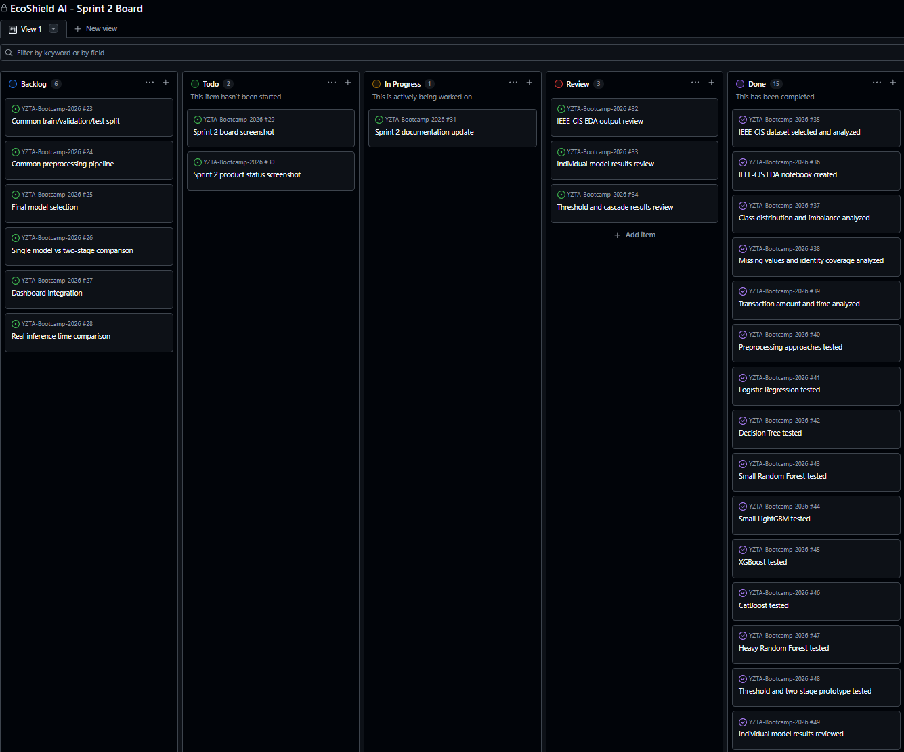
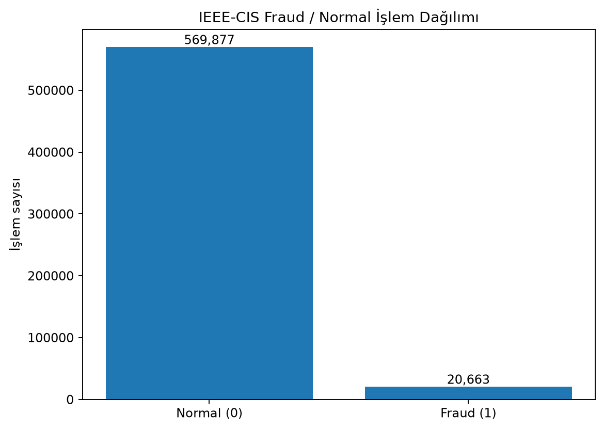
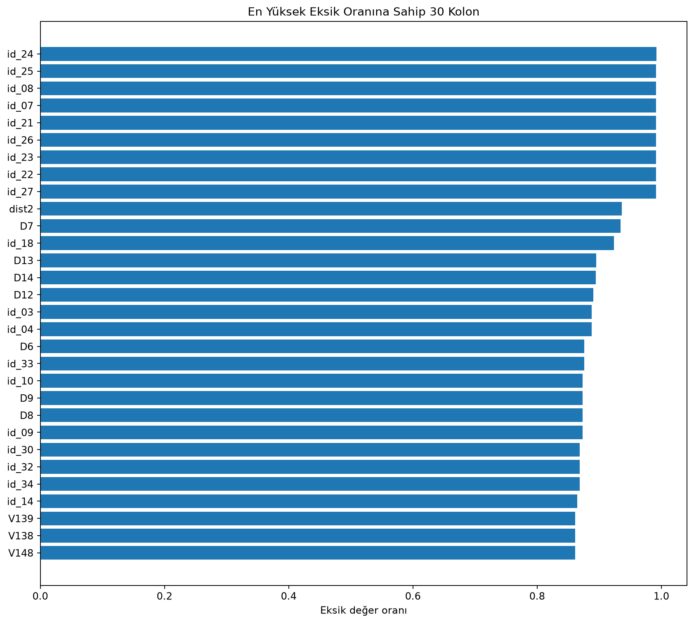
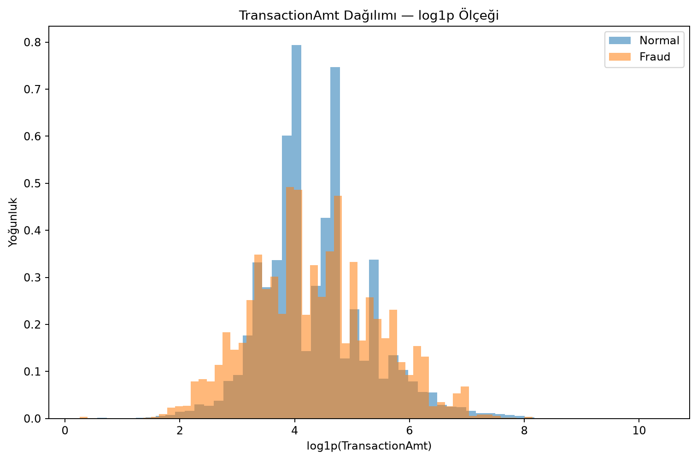
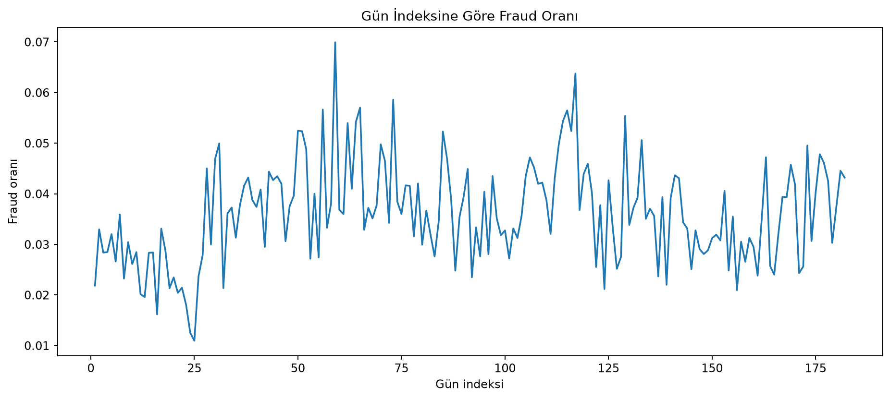
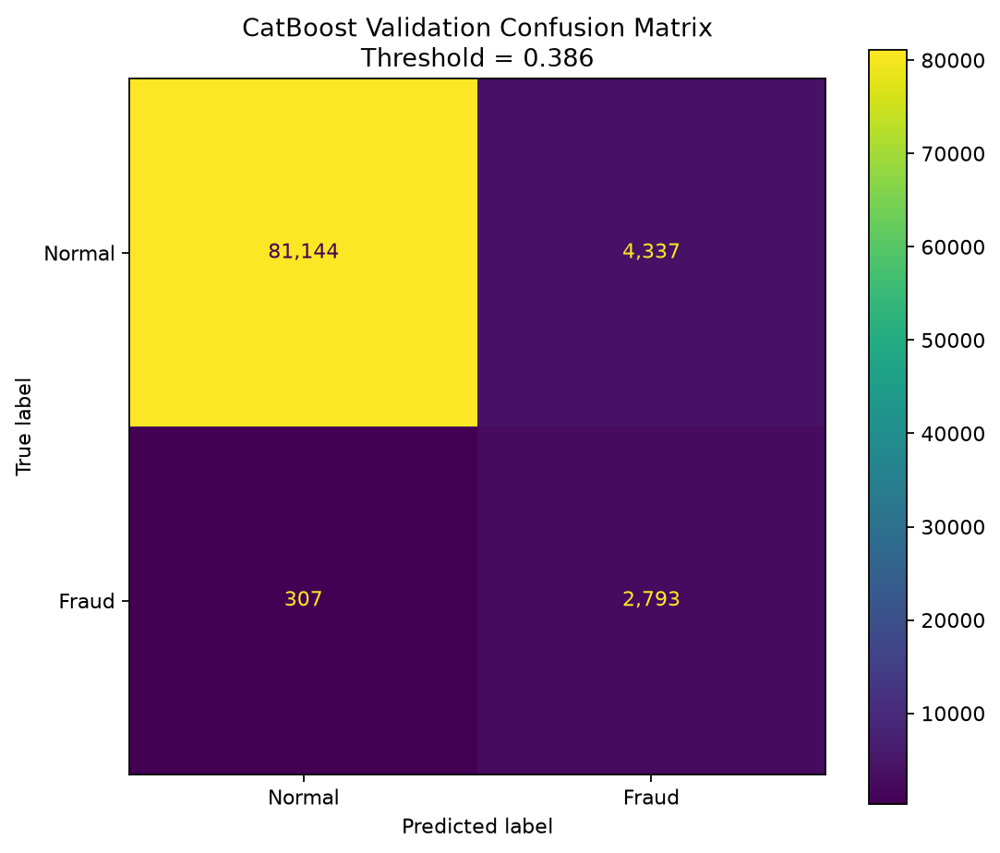
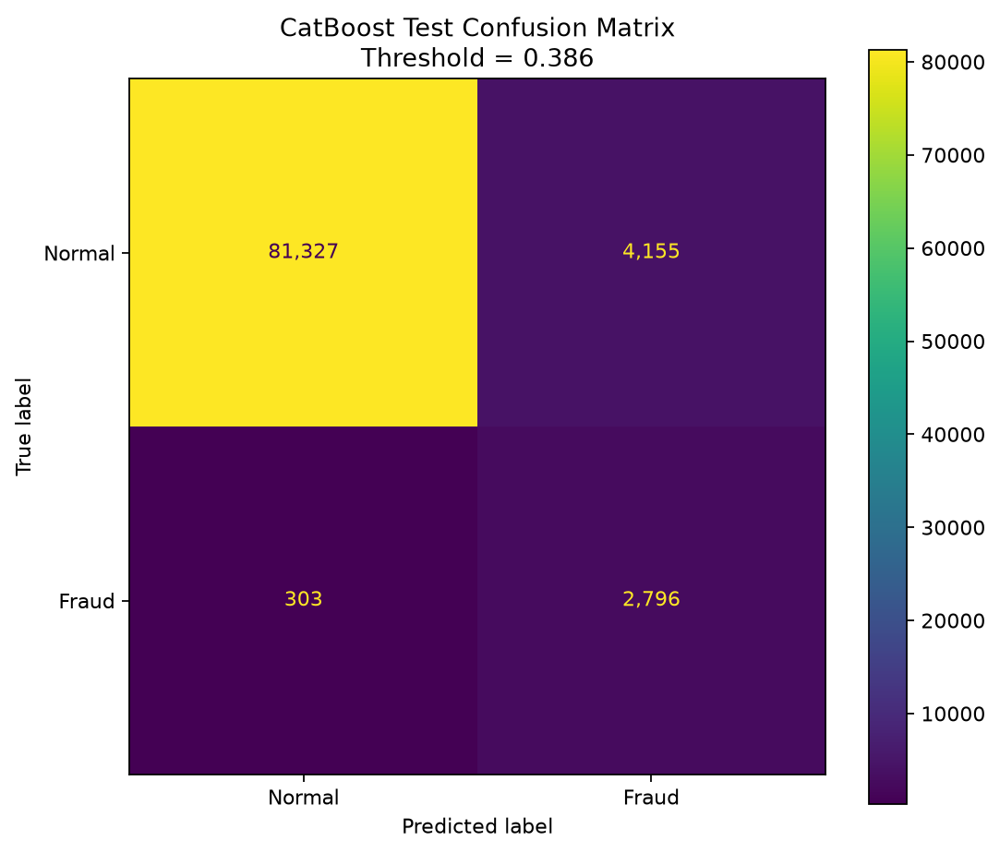
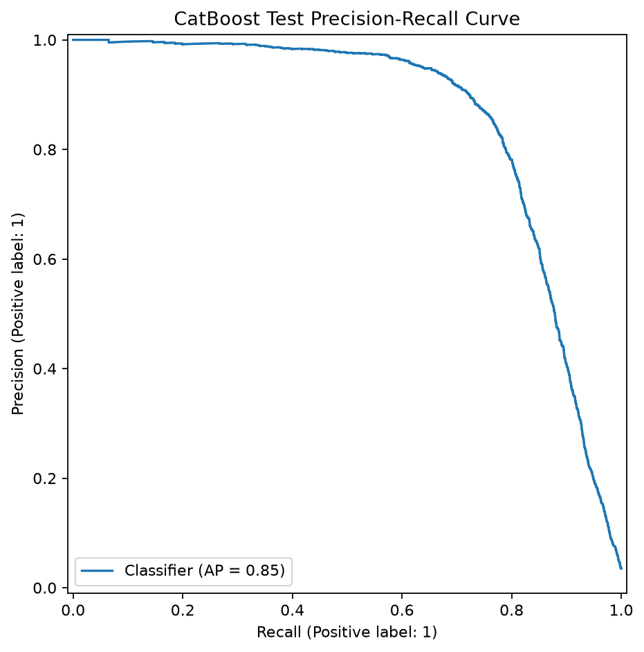
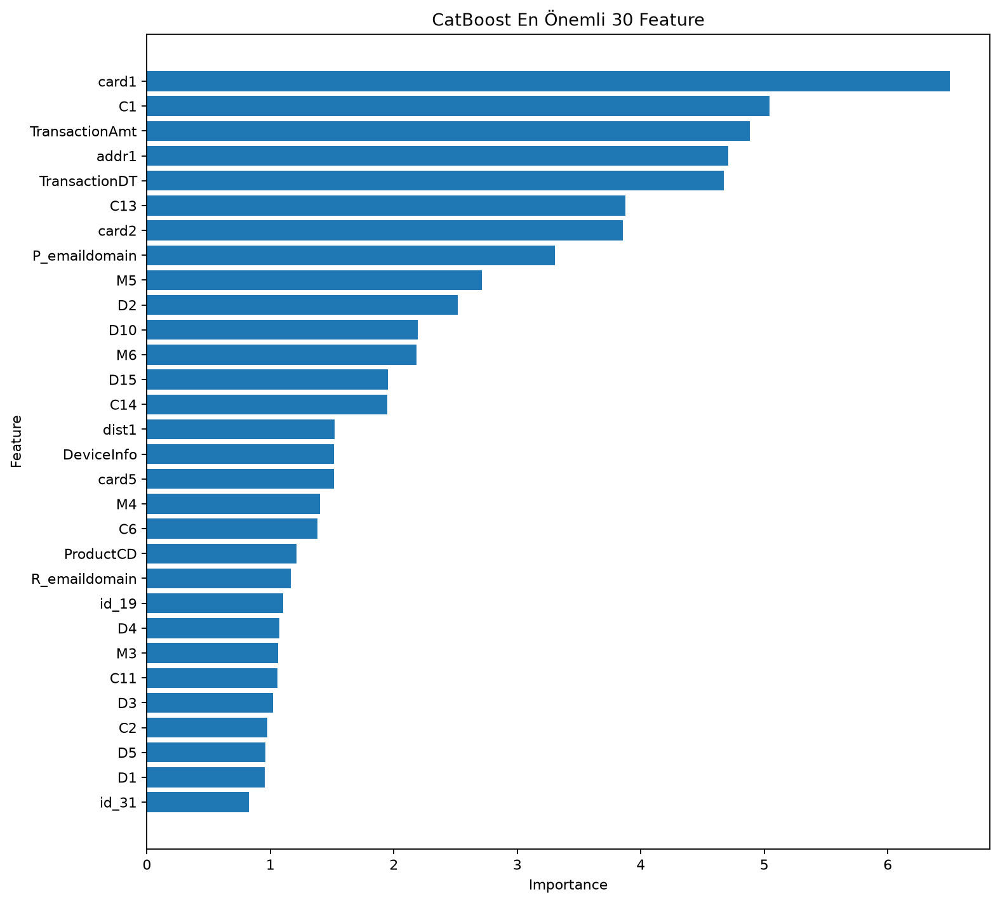

# Sprint 2 — EcoShield AI

## Sprint Amacı

Sprint 2 kapsamında, Sprint 1’de belirlenen fraud detection problemine yönelik daha kapsamlı veri analizi ve modelleme çalışmaları yürütülmüştür.

Bu sprintin ana hedefleri şunlardır:

- IEEE-CIS Fraud Detection veri setinin yapısını incelemek
- Veri setinin preprocessing ve modellemeye uygunluğunu değerlendirmek
- Farklı model ailelerini bireysel çalışmalarla denemek
- Hafif ve ağır model yaklaşımını deneysel bir seçenek olarak incelemek
- Threshold değerlerinin model performansı üzerindeki etkisini gözlemlemek
- Accuracy dışındaki fraud odaklı metrikleri değerlendirmek
- Ekip üyelerinin farklı yaklaşımlarını karşılaştırarak teknik revize alanlarını belirlemek

Bu sprintte kesin bir final model veya final mimari seçilmemiştir. Yapılan çalışmalar, sonraki sprintte uygulanacak ortak ve karşılaştırılabilir modelleme sürecine temel oluşturmuştur.

---

## Sprint İçinde Tamamlanması Tahmin Edilen Puan

**100 puan**

## Puan Tamamlama Mantığı

Sprint 2 iş yükü; veri analizi, farklı model denemeleri, iki aşamalı mimari araştırması, model çıktılarının karşılaştırılması ve sprint dokümantasyonu dikkate alınarak 100 puan üzerinden değerlendirilmiştir.

| Görev Grubu | Puan |
|---|---:|
| IEEE-CIS veri setinin incelenmesi ve EDA | 20 |
| Veri hazırlama ve preprocessing denemeleri | 15 |
| Hafif model adaylarının eğitilmesi | 15 |
| Ağır model adaylarının eğitilmesi | 20 |
| Threshold ve iki aşamalı mimari denemeleri | 15 |
| Model çıktılarının karşılaştırılması ve teknik değerlendirme | 10 |
| Sprint dokümantasyonu ve ürün durumu çıktıları | 5 |
| **Toplam** | **100** |

---

## Sprint 2 Backlog

| No | Sprint Task | Durum |
|---|---|---|
| SB2-1 | IEEE-CIS Fraud Detection veri setinin proje kapsamına alınması | Tamamlandı |
| SB2-2 | `train_transaction` ve `train_identity` tablolarının incelenmesi | Tamamlandı |
| SB2-3 | IEEE-CIS veri seti için ayrı EDA notebook’unun hazırlanması | Tamamlandı |
| SB2-4 | Fraud / normal işlem dağılımının analiz edilmesi | Tamamlandı |
| SB2-5 | Eksik değer, identity kapsama ve cardinality analizlerinin yapılması | Tamamlandı |
| SB2-6 | Transaction amount ve zaman değişkenlerinin incelenmesi | Tamamlandı |
| SB2-7 | EDA görselleri ve raporlarının kaydedilmesi | Tamamlandı |
| SB2-8 | Logistic Regression modelinin denenmesi | Tamamlandı |
| SB2-9 | Decision Tree modelinin denenmesi | Tamamlandı |
| SB2-10 | Küçük Random Forest modelinin denenmesi | Tamamlandı |
| SB2-11 | Küçük LightGBM modelinin denenmesi | Tamamlandı |
| SB2-12 | XGBoost modelinin denenmesi | Tamamlandı |
| SB2-13 | CatBoost modelinin denenmesi | Tamamlandı |
| SB2-14 | Ağır Random Forest modelinin denenmesi | Tamamlandı |
| SB2-15 | Hafif ve ağır model yaklaşımının deneysel olarak kurulması | Tamamlandı |
| SB2-16 | Hafif model threshold değerlerinin karşılaştırılması | Tamamlandı |
| SB2-17 | Compute-saving proxy hesabının denenmesi | Tamamlandı |
| SB2-18 | Ekip üyelerinin bireysel modelleme çalışmalarının karşılaştırılması | Tamamlandı |
| SB2-19 | Ortak split ve preprocessing standardının belirlenmesi | Sonraki sprinte aktarıldı |
| SB2-20 | Nihai model ve mimari seçiminin yapılması | Sonraki sprinte aktarıldı |
| SB2-21 | Seçilen modellerin ortak pipeline içerisinde birleştirilmesi | Sonraki sprinte aktarıldı |
| SB2-22 | Dashboard ve ürün entegrasyonu | Sonraki sprinte aktarıldı |

---

## Backlog Düzeni ve Story Seçimleri

Sprint 2’de doğrudan final ürün geliştirmeye geçmek yerine, modelleme tarafındaki alternatiflerin geniş biçimde denenmesine öncelik verilmiştir.

Bu doğrultuda:

- Sprint 1’de kullanılan Credit Card Fraud Detection veri setine ek olarak IEEE-CIS Fraud Detection veri seti incelenmiştir.
- Ekip üyeleri EDA, preprocessing ve model eğitim süreçlerini bireysel olarak yürütmüştür.
- Farklı model aileleri ve model parametreleri denenmiştir.
- Hafif ve ağır model yaklaşımı kesin mimari olarak değil, performansı ölçülecek deneysel bir seçenek olarak ele alınmıştır.
- Threshold değerlerinin fraud yakalama oranı ve ağır modele yönlendirilen işlem oranı üzerindeki etkisi incelenmiştir.

Bireysel çalışmalar aynı veri seti üzerinde yürütülmüş olsa da kullanılan train/validation/test oranları, preprocessing adımları ve model parametreleri farklılık göstermiştir. Bu nedenle elde edilen skorların doğrudan nihai model karşılaştırması olarak kullanılmamasına; sonraki aşamada ortak deney protokolü oluşturulmasına ihtiyaç olduğu değerlendirilmiştir.

---

## Daily Scrum Notları

### Daily Scrum 1

**Tarih:** 11.07.2026

**Toplantı Özeti:**

Sprint 2 kapsamında modelleme tarafında izlenebilecek yöntemler değerlendirilmiştir. Bu toplantıda kesin bir model seçimi yapılmamış; farklı model alternatiflerinin denenmesi ve sonuçlara göre değerlendirme yapılması planlanmıştır.

Projenin ayırt edici yönlerinden biri olabilecek hafif-ağır model mimarisi deneysel bir seçenek olarak ele alınmıştır. Bu yaklaşıma göre hafif modelin tüm işlemleri hızlı biçimde taraması, riskli gördüğü işlemleri ağır modele yönlendirmesi ve ağır modelin yalnızca yönlendirilen işlemler üzerinde final fraud probability / risk skoru üretmesi planlanmıştır.

Hafif model tarafında Logistic Regression, Decision Tree, küçük Random Forest ve küçük LightGBM; ağır model tarafında ise LightGBM, XGBoost, CatBoost ve Random Forest gibi modellerin denenmesi değerlendirilmiştir.

Model sonuçlarının yalnızca accuracy üzerinden yorumlanmaması; recall, precision, F1-score, ROC-AUC ve PR-AUC metriklerinin birlikte incelenmesi gerektiği vurgulanmıştır.

Ayrıca IEEE-CIS Fraud Detection veri setinin incelenmesi, preprocessing ve modelleme açısından uygunluğunun test edilmesi planlanmıştır. İki aşamalı yapının compute-saving sağlayıp sağlamadığı ve fraud detection performansını koruyup korumadığı deney sonuçları üzerinden değerlendirilecektir.

**Alınan kararlar ve planlanan çalışmalar:**

- Kesin model seçimi yapılmadan farklı model aileleri denenecek.
- IEEE-CIS veri seti için ayrı veri analizi yürütülecek.
- Hafif ve ağır model adayları ayrı ayrı değerlendirilecek.
- İki aşamalı model yapısı deneysel olarak kurulacak.
- Threshold değerlerinin recall ve yönlendirme oranı üzerindeki etkisi incelenecek.
- Accuracy yerine fraud odaklı metrikler birlikte raporlanacak.
- Nihai mimari kararı sonuçlar karşılaştırıldıktan sonra verilecek.

**Riskler:**

- Hafif model threshold değerinin yüksek seçilmesi fraud işlemlerin ağır modele ulaşmadan elenmesine neden olabilir.
- Threshold değerinin çok düşük seçilmesi ağır modele gönderilen işlem sayısını artırarak beklenen compute-saving avantajını azaltabilir.
- IEEE-CIS veri setindeki eksik değerler, yüksek cardinality ve geniş feature yapısı preprocessing sürecini zorlaştırabilir.

---

### Daily Scrum 2

**Tarih:** 17.07.2026

**Toplantı Özeti:**

Toplantıda her ekip üyesinin verinin keşifsel analizinden model eğitimine kadar tamamen bireysel ve farklı yaklaşımlarla yürüttüğü çalışmalar sırayla incelenmiştir.

Ekip üyeleri aynı IEEE-CIS veri seti üzerinde XGBoost, CatBoost, küçük LightGBM, Logistic Regression, Decision Tree ve Random Forest modellerini farklı train/validation/test dağılımları, preprocessing yöntemleri ve model parametreleri kullanarak eğitmiştir.

Toplantı boyunca bireysel çalışmaların:

- Veri hazırlama adımları
- Eksik değer yönetimi
- Kategorik değişken işlemleri
- Train/validation/test ayrımları
- Class imbalance yöntemleri
- Model parametreleri
- Threshold yaklaşımları
- Model metrikleri
- Eğitim ve tahmin süreçleri

tek tek değerlendirilmiştir.

Farklı yöntemlerle elde edilen çıktıların doğrudan karşılaştırılmasının adil olmayabileceği görülmüştür. Çünkü model sonuçları yalnızca algoritmadan değil; veri bölme yöntemi, preprocessing akışı, kullanılan feature’lar, class imbalance yaklaşımı ve threshold değerlerinden de etkilenmektedir.

Bu nedenle modellerin genel performansını iyileştirmek ve sonuçları karşılaştırılabilir hale getirmek için çeşitli teknik revize önerileri oluşturulmuştur.

**Teknik değerlendirmeler:**

- Modellerin ortak bir train/validation/test ayrımı üzerinde yeniden denenmesi gerekmektedir.
- Preprocessing adımlarının mümkün olduğunca ortaklaştırılması gerekmektedir.
- Threshold seçiminin yalnızca validation verisi üzerinden yapılması gerekmektedir.
- Test verisinin model veya threshold seçimi için kullanılmaması gerekmektedir.
- Accuracy dışında precision, recall, F1-score, ROC-AUC ve özellikle PR-AUC metrikleri birlikte raporlanmalıdır.
- Hafif model tarafında inference süresi ve ağır modele yönlendirilen işlem oranı da ölçülmelidir.
- İki aşamalı sistem, tek ağır model yaklaşımıyla aynı test seti üzerinde karşılaştırılmalıdır.
- Compute-saving ifadesinin yalnızca yönlendirilmeyen işlem oranıyla değil, gerçek inference süresiyle de desteklenmesi gerekmektedir.

**Alınan kararlar ve sonraki adımlar:**

- Bireysel çalışmalar korunacak ve teknik deney kaydı olarak değerlendirilecek.
- Modeller için ortak değerlendirme protokolü hazırlanacak.
- Seçilen aday modeller aynı veri ayrımı üzerinde yeniden eğitilecek.
- Preprocessing yöntemleri gözden geçirilerek ortaklaştırılacak.
- Hafif-ağır model yaklaşımı ve tek model yaklaşımı karşılaştırılacak.
- Nihai model seçimi Sprint 2 çıktıları tek başına kullanılarak yapılmayacak.
- Teknik revizyonlar tamamlandıktan sonra model seçimi ve ürün entegrasyonuna geçilecek.

**Riskler:**

- Farklı split ve preprocessing yöntemleriyle üretilen metriklerin doğrudan karşılaştırılması yanıltıcı olabilir.
- Aynı isimdeki model, farklı parametrelerle tamamen farklı sonuçlar üretebilir.
- Class imbalance yöntemlerinin validation ve test verisine yanlış uygulanması veri sızıntısına yol açabilir.
- Aşırı düşük threshold yüksek recall sağlarken sistemi pratikte verimsiz hale getirebilir.

---

## Sprint Board Update

Sprint 2 board’unda görevler şu kolonlar üzerinden takip edilmiştir:

```text
Backlog
To Do
In Progress
Review
Done
```

Sprint 2 sonunda IEEE-CIS EDA, bireysel model eğitimleri, threshold analizi ve deneysel hafif-ağır model çalışmaları tamamlanan işler arasında yer almıştır.

Ortak split, ortak preprocessing, nihai model seçimi, final pipeline ve dashboard entegrasyonu sonraki sprint çalışmalarına aktarılmıştır.

Sprint 2 board ekran görüntüsü aşağıdaki konuma eklenebilir:

```text
assets/sprint-2/sprint_board.png
```



---

## Ürün Durumu

Sprint 2 sonunda ürün, Sprint 1’deki veri analizi seviyesinden model denemelerinin gerçekleştirildiği deneysel prototip aşamasına ilerlemiştir.

Bu sprintte:

- IEEE-CIS Fraud Detection veri seti için kapsamlı EDA hazırlanmıştır.
- Fraud / normal işlem dağılımı analiz edilmiştir.
- Eksik değerler, identity kapsamı, kategorik değişkenler ve cardinality yapısı incelenmiştir.
- Logistic Regression, Decision Tree, küçük Random Forest, küçük LightGBM, XGBoost, CatBoost ve Random Forest modelleri farklı yaklaşımlarla denenmiştir.
- Hafif ve ağır model mantığı deneysel olarak uygulanmıştır.
- Threshold değerlerinin yönlendirme ve recall üzerindeki etkileri incelenmiştir.
- Ağır modele gönderilmeyen işlem oranı üzerinden compute-saving proxy hesabı denenmiştir.
- Model karşılaştırmalarında ortak deney protokolü ihtiyacı tespit edilmiştir.

### IEEE-CIS Class Distribution



### IEEE-CIS Missing Value Analizi



### Transaction Amount Analizi



### Gün Bazlı Fraud Oranı



### CatBoost Validation Confusion Matrix



### CatBoost Test Confusion Matrix



### CatBoost Precision-Recall Curve



### CatBoost Feature Importance



---

## Teknik Çalışmalar

### IEEE-CIS EDA

IEEE-CIS eğitim verisinde toplam **590.540 işlem** bulunmaktadır.

Sınıf dağılımı:

| Sınıf | İşlem Sayısı |
|---|---:|
| Normal işlem | 569.877 |
| Fraud işlem | 20.663 |

Veri setinde ciddi class imbalance bulunduğu doğrulanmıştır. Bu nedenle accuracy metriğinin tek başına uygun olmadığı; recall, precision, F1-score, ROC-AUC ve PR-AUC metriklerinin birlikte değerlendirilmesi gerektiği görülmüştür.

EDA kapsamında ayrıca:

- Transaction ve identity tablolarının yapısı
- Identity bilgilerinin kapsama oranı
- Eksik değer oranları
- Yüksek cardinality içeren kolonlar
- Transaction amount dağılımı
- Transaction zaman yapısı
- Temel kategorik değişkenlere göre fraud oranları
- Sayısal değişkenlerin target ile ilişkileri

incelenmiştir.

### Hafif Model Denemeleri

Hafif model tarafında şu model aileleri değerlendirilmiştir:

- Logistic Regression
- Decision Tree
- Küçük Random Forest
- Küçük LightGBM

“Küçük model” ifadesi, model kapasitesinin ve hesaplama maliyetinin sınırlandırılmış olmasını ifade etmektedir. Örneğin küçük Random Forest’ta ağaç sayısı ve derinlik; küçük LightGBM’de boosting turu, derinlik ve yaprak sayısı düşük tutulmaktadır.

Hafif modelin amacı final tahmini tek başına üretmekten çok:

- Tüm işlemleri hızlı taramak
- Fraud işlemleri mümkün olduğunca kaçırmamak
- Riskli işlemleri ağır modele yönlendirmek
- Ağır model çağrı sayısını azaltmak

olarak değerlendirilmiştir.

### Ağır Model Denemeleri

Ağır model tarafında şu model aileleri denenmiştir:

- Random Forest
- LightGBM
- XGBoost
- CatBoost

Ağır modellerin daha yüksek kapasiteyle fraud ve normal işlemleri ayırması hedeflenmiştir. Ancak modeller farklı split, preprocessing ve parametrelerle eğitildiği için mevcut sonuçlar nihai model sıralaması olarak değerlendirilmemiştir.

### Threshold Analizi

Hafif modelin ürettiği fraud olasılığı için farklı threshold değerleri denenmiştir.

Threshold değeri düşürüldüğünde:

- Daha fazla işlem riskli kabul edilmiştir.
- Ağır modele yönlendirilen işlem oranı artmıştır.
- Hafif model recall değeri yükselmiştir.
- Compute-saving avantajı azalmıştır.

Threshold değeri yükseltildiğinde:

- Daha az işlem ağır modele yönlendirilmiştir.
- Compute-saving proxy artmıştır.
- Fraud işlemlerin hafif aşamada elenme riski yükselmiştir.

Bu nedenle threshold seçiminin yalnızca recall veya yalnızca yönlendirme oranına göre yapılmaması gerektiği görülmüştür.

### İki Aşamalı Model Denemesi

Deneysel iki aşamalı sistemde:

```text
İşlem
  ↓
Hafif model
  ↓
Düşük risk → Normal kabul edilir
Yüksek risk → Ağır modele yönlendirilir
  ↓
Ağır model
  ↓
Final fraud kararı
```

akışı uygulanmıştır.

İlk deneylerde ağır modele yönlendirilmeyen işlem oranı üzerinden compute-saving proxy hesaplanmıştır. Ancak gerçek compute-saving değerlendirmesi için sonraki aşamada:

- Tek ağır model inference süresi
- Cascade toplam inference süresi
- Hafif model inference süresi
- Ağır modele yönlendirilen işlem sayısı
- RAM ve işlemci kullanımı
- Final fraud metrikleri

birlikte ölçülmelidir.

---

## Sprint Review

Sprint 2 kapsamında IEEE-CIS Fraud Detection veri seti proje kapsamına alınmış ve veri seti üzerinde ayrı bir EDA çalışması gerçekleştirilmiştir.

Ekip üyeleri modelleme sürecini bireysel olarak yürütmüş; Logistic Regression, Decision Tree, küçük Random Forest, küçük LightGBM, Random Forest, XGBoost ve CatBoost modellerini farklı veri bölme, preprocessing ve parametre yaklaşımlarıyla denemiştir.

Hafif ve ağır model yaklaşımı deneysel olarak uygulanmış, threshold değerlerinin fraud recall ve ağır modele yönlendirme oranı üzerindeki etkileri incelenmiştir.

Sprint sonunda şu çıktılar elde edilmiştir:

- IEEE-CIS veri yapısı daha ayrıntılı biçimde anlaşılmıştır.
- Class imbalance problemi doğrulanmıştır.
- Farklı model aileleri için ilk deneyler tamamlanmıştır.
- Hafif-ağır model mimarisinin teknik olarak uygulanabilir olduğu görülmüştür.
- Threshold seçiminin sistem performansı için kritik olduğu anlaşılmıştır.
- Compute-saving hesabının yalnızca yönlendirme oranıyla sınırlandırılmaması gerektiği belirlenmiştir.
- Modellerin adil biçimde karşılaştırılması için ortak split ve preprocessing ihtiyacı tespit edilmiştir.

Sprint sonunda **nihai model veya nihai mimari seçilmemiştir**.

---

## Sprint Retrospective

### İyi Gidenler

- IEEE-CIS gibi daha kapsamlı bir fraud detection veri seti başarıyla analiz edilmiştir.
- Ekip üyeleri farklı model aileleri üzerinde uygulamalı deneyim kazanmıştır.
- EDA’dan model eğitimine kadar tüm süreçler bireysel olarak uygulanmıştır.
- Hafif ve ağır model mantığı teorik seviyeden deneysel prototip seviyesine taşınmıştır.
- Threshold ile recall ve yönlendirme oranı arasındaki ilişki gözlemlenmiştir.
- Model sonuçlarının accuracy dışındaki metriklerle değerlendirilmesi gerektiği ekip genelinde netleşmiştir.
- Farklı yaklaşımların güçlü ve zayıf yönleri ortak toplantıda değerlendirilmiştir.

### Zorlayan Noktalar

- IEEE-CIS veri setinin geniş ve eksik değer ağırlıklı yapısı preprocessing sürecini zorlaştırmıştır.
- Ekip üyelerinin farklı split ve preprocessing yöntemleri kullanması sonuçların doğrudan karşılaştırılmasını zorlaştırmıştır.
- Aynı model aileleri farklı parametreler nedeniyle farklı davranışlar göstermiştir.
- Hafif model threshold seçiminin recall ve compute-saving arasında ciddi bir trade-off oluşturduğu görülmüştür.
- Compute-saving hesabının gerçek işlem süresiyle desteklenmediği durumlarda yalnızca proxy olarak kalacağı anlaşılmıştır.
- Bazı model dosyalarının GitHub’ın normal dosya boyutu sınırını aşabileceği görülmüştür; bu dosyaların repository dışında tutulması gerekmiştir.

### Bir Sonraki Sprintte İyileştirilecekler

- Ortak train/validation/test indeksleri kullanılacak.
- Modeller aynı preprocessing protokolüyle yeniden karşılaştırılacak.
- Threshold yalnızca validation verisi üzerinden seçilecek.
- Test verisi final değerlendirme dışında kullanılmayacak.
- Ortak model karşılaştırma tablosu hazırlanacak.
- Hafif model için recall, routed rate ve inference süresi birlikte raporlanacak.
- Ağır model için precision, recall, F1, ROC-AUC ve PR-AUC birlikte değerlendirilecek.
- Tek ağır model ile iki aşamalı sistem aynı test seti üzerinde karşılaştırılacak.
- Compute-saving proxy gerçek inference süresiyle desteklenecek.
- Nihai model ve mimari seçildikten sonra dashboard entegrasyonuna geçilecek.

---

## Sprint 2 Sonuç Özeti

Sprint 2 kapsamında EcoShield AI projesi, temel veri analizinden çoklu model denemelerinin yapıldığı deneysel modelleme aşamasına ilerlemiştir.

IEEE-CIS Fraud Detection veri seti ayrıntılı olarak incelenmiş; veri setindeki class imbalance, eksik değer, identity kapsama, cardinality ve işlem dağılımı problemleri ortaya konmuştur.

Ekip üyeleri Logistic Regression, Decision Tree, küçük Random Forest, küçük LightGBM, Random Forest, XGBoost ve CatBoost modellerini farklı yaklaşımlarla eğitmiş ve sonuçlarını karşılaştırmıştır. Hafif-ağır model mimarisi deneysel bir seçenek olarak uygulanmış, threshold değerlerinin fraud yakalama performansı ve ağır modele yönlendirme oranı üzerindeki etkileri gözlemlenmiştir.

Ancak farklı split, preprocessing ve model parametreleri kullanıldığı için Sprint 2 sonuçları nihai model seçimi olarak değerlendirilmemiştir. Sprint sonunda ortak bir deney protokolüne ihtiyaç olduğu belirlenmiştir.

Sonraki sprintte modellerin aynı veri ayrımı ve ortak preprocessing adımlarıyla yeniden değerlendirilmesi, tek model ve iki aşamalı yaklaşımın adil biçimde karşılaştırılması, gerçek inference süresinin ölçülmesi ve sonuçlara göre nihai model mimarisinin seçilmesi hedeflenmektedir.
